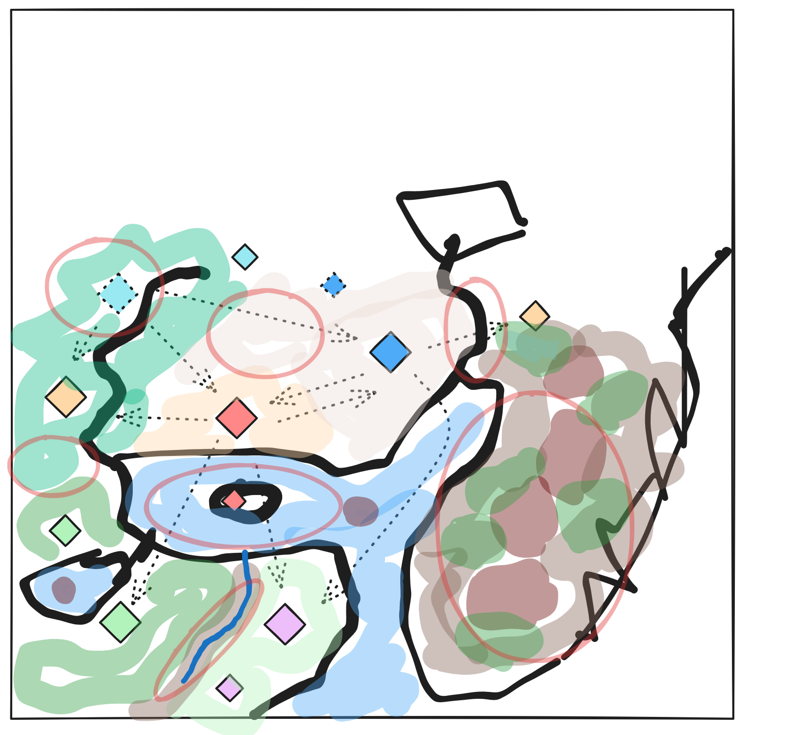

# Castles of Annuvin

A 6-player map that removes the tedious parts of the game and presents many
PvP and PvE opportunities!

## Special features

- No taverns after you hire your two starting heroes. Additional heroes can be
  obtained from prisons.
- Creature dwellings revert to the red (Might) player every turn, removing the
  need for caravan micro. Red's starting towns can't build caravans.
- Lots of hero leveling and multiclassing opportunities. It should be possible
  to get grandmaster in 2 or 3 skills.

## Victory condition

- Capture 3 of the 6 castle towns on the map (6 of the 12 towns start with
  Castles, 6 have the Castle disabled)

## Map sketch



## Strategy Notes

The expansions introduce item combos that grant unique buffs.
See: http://www.heroesofmightandmagic.com/heroes4/artifacts_tgs.shtml

- Cloak of Darkness + Ring of Light = automatic Guardian Angel
- Tiger Armor + Tiger Helm + Frost Hammer = regneration + dragon strength
- Harmonic Chainmail + Necklace of Muses + Aiffe's Mandolin = attack casts
  song of peace 
- necklace of balance + ice scales + flame of chaos = magic mirror ability
- archmage's hat + staff of disruption + wayfaring boots + ring of flares +
  angelfeather cloak = ignore magic resistance 

How to make Diplomacy useful:

> ...Secondly, by the time you develop diplomacy, most of the guards may already be defeated - diplomacy requires a large map with plenty of guards to be useful. Thirdly, if the map has plenty of towns and mines, the bonuses of Nobility, Estates and Mining may provide only a small advantage overall.
>
> I recommend going for Nobility on maps where resources, towns and mines are scarce and guards are plentiful. Tactics and Nobility is a good combination on that kind of map, as it will also turn your hero into a Lord Commander (advanced class) and give a great bonus of +2 morale to all creatures in his/her army.
>
> — http://www.heroesofmightandmagic.com/heroes4/mightskills.shtml

## Globals

### Timing

- It should be possible to get out of starting area on normal difficulty by the
  end of week 2.

### Army Values

- Starting troops for each player have a value of ~180 PEONS.
- Gates leading out of starting areas are guarded by 444 PEONS
- town guards: 80 PEONS.
- "Random Monster" strength - 222–2222 PEONS

### Events

- **RevertDwellingOwner**: A continuous event calls this triggerable event,
  which all dwellings should handle by changing their owner to Red if it is not
  Nobody.
- **GiveOrangeTown** Each player's starting town has a triggerable event
  `Give<Color>Town`, e.g. `GiveOrangeTown`. These events are triggered by a day
  1 timed event. Script:

  ```
  if [Orange Player is Computer] then [
    Change Owner to Orange Player
    Give 14 Medusas to Garrison
    Construct Tavern
  ]
  ```

  This event is needed because the AI can't figure out how to get out of its
  starting area. TODO: is there a simpler solution?

### Adventure Objects

- **Window of the Magi: Red** reveals the castle towns.
- **Yellow Two-Way Portal** goes to Orange's prologue area
- **Red Two-Way Portal** connects Orange's two (Chaos) towns
- **Teal Two-Way Portal** connects Teal to a high-conflict area near Blue

## TODO

- Add storyline event: explain why dwellings revert owner to Red
- Add storyline event: hint that the Ring of Greater Negation is needed to
  defeat Hafgan
- Scatter tips around the map in signs and bottles
- Give each castle town High Priority for the AI

## Playtest notes

### Play 1 (Red)

- I want a bow!
- random item generates potions
- want more treasure chests. At least 2 per monster
- items, treasure, powerups
- 2nd level monsters exhausted by day 3 wk 2 (turn 10)
- On turn 10, I had 2 lvl 6 barbarians, 50 centaurs, 12 harpies, and 4 cyclopes
- = 545 peons (not counting heroes)

### Play 2 (Red)

- cleared red starting area by turn 18
- 2 lvl 10 barbarians, 47 centaurs, 6 harpies, 7 cyclopes by day 4 of week 3 (turn 18)
- grandmaster archery by turn 18
- a good monster distribution for progression and challenge seems to be: 7-8 monster 1s, 7-8 monster 2s, some 3s

### Play 3 (Red)

- treasure by veteran's hall can be stolen
- the guard radius is only 2, not 3!
- want more multiclassing opportunities (scouting, nobility, tactics, life magic)

### Play 4 (Red)

- Nomad tents start as owned by red!
- 370 PEONS for gate guard is too easy.
  - Attacked with: lvl 10 barbarian with expert combat, expert melee, GM archery, and basic magic resistance, plate mail, gambler's deck, crossbow, 13 harpies, 4 cyclopes, and 49 centaurs.

### Play 5 (Teal)

- Need to add an event that sets your gold to 4000
- add MOAR GOLD to the map to balance this
- necromancer needs shrines of magic early (no town). Conservatory might be good too.
- need sanctuary (what if hero dies?)
- hero out of mana after fighting too many imps.

### Play 6 (Teal)

- Need free gold

### Play 7 (Teal)

- Captured Acharna on day 6, with:
  - 21 cerberi
  - 7 ghosts
  - 29 skeletons
  - level 3 death knight with plate mail, crest of valor, warlord's ring
  - level 3 necromancer
  - 4110 gold
  - could probably do with a few less gold piles at the start (I added 6 since the last play) and sub one of the wood piles for gold
- OH NOES the Mansion is disabled (because the tavern is)
- BUG: barrow mound doesn't reset owner
- Gold is too slow after capturing the town. I need money to spend on buildings!
  - Possible solution: city hall should already be built (saves 5000 gold)

### Play 8 (Teal)

- Got Acharna by day 3
- Exited starting area with 2 level 7 heroes, including GM necromancy
- Wants as I'm in the southern third of the starting area:
  - levels
  - artifacts
  - maybe gold?
- got out of starting area by day 3 of week 3 (turn 17)

### Play 9 (Orange)

- Need to block the portal to the eastern town so the player doesn't
  accidentally go that way.
- Need more spells

### Play 10 (Orange)

- Bug: Orc towers don't revert
- Still need to block the portal to the eastern town so the player doesn't
  accidentally go that way.
- Bug: Garrison is not occupied
- Didn't get to town until day 7. Add troughs?

### Play 11 (Orange)

- level 3 monster in middle of starting area blocks southward travel between
  shrines
- Sparks should be banned. It's useless (Magic Arrow does more damage and costs
  the same, and you really don't want your sorcerer getting close to enemies)

### Play 12 (Orange)

- Bug: altars are always magic, not scouting
- Outta spell points!
- Probably need an alchemist's lab, and more ore
- can't get through gap between altars and eastern tower