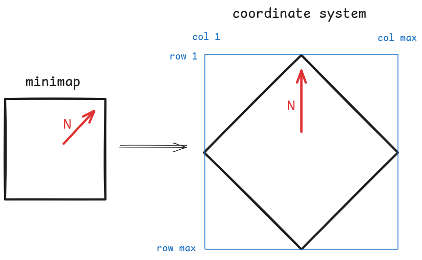

# The Heroes IV Coordinate System

The coordinates of each map tile are given as a pair (row, col).

In the game, the tiles appear visually as an isometric grid, but they are
numbered as a square grid.

See also the page on [Map Sizes](map-sizes.md).