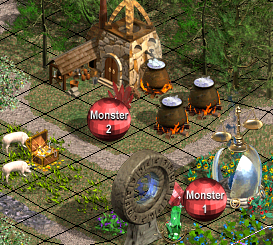

# A Pattern Language for Heroes IV Maps

## Regions

- A small map should have ~2 regions
- A medium map, with four times the area, should have ~8
- A large map, ~18
- An extra-large map, ~32

A region can be land or sea. If you are making a map with a coastline, lakes,
or inland seas, each body of water is a region.

The regions do not need to be the same size! They can vary quite a bit. The
ratio between the smallest and largest can be 4:1 or perhaps more.

Each region should be a coherent shape — [Positive Space].

Regions that are simply "left over" after brushing in the terrain for the other
regions tend to have negative/bad shape. To counteract this, go back and forth
between adjacent regions as you brush, expanding and adjusting each until the
whole configuration looks good. Making the regions interlock or interpenetrate
can help — [Deep Interlock].

[Deep Interlock]: https://benchristel.com/posts/alexandrian-software/08-deep-interlock-and-ambiguity.html

- Choose terrain type for each region
- Regions with movement-limiting terrain (rough, snow, sand, swamp) should be
  smaller and have tighter spacing — [Rhythmic Spacing].

## Starting Regions

- Choose a region for each player start in
- Place a town in each starting region
  - If the town is placed close to the center of the region, the map can
    feel more "open world" and less railroaded, which can be a good or a bad
    thing depending on what you're aiming for.

Near each town, place an Ore Pit and a Sawmill. These can be unguarded, or
guarded by level 1 monsters — [Level 1 Encounters].

## Folded Boundaries

- Use an obstacle brush to create boundaries between the regions.
- Each boundary should be "folded" into a zigzag or wiggle, with many
  peninsulas and nooks. These will be filled by monsters and treasure. See:
  [Deep Interlock], [Alternating Repetition].
- The entire center formed by the boundary can be quite thick: 10 tiles or more.

[Alternating Repetition]: https://benchristel.com/posts/alexandrian-software/04-alternating-repetition.html

See [Mountains Above, Trees Below] for how to brush an obstacle center.

## Rhythmic Spacing

[Rhythmic Spacing]: #rhythmic-spacing

Each region of the map should have a more or less consistent _spacing_. This
spacing determines two structural properties of the map:

- the width of the major paths players will take as they travel around the
  map — [Rooms and Paths].
- the distance between interactive centers.

Spacing affects the pace of the map. A tight spacing means you can do more in
one turn, and makes budgeting your movement more important. Looser spacing
creates a more relaxed feel. Small maps tend to have a tighter spacing.

The minimum spacing is about **2–4 tiles** (Danger in the Trees is an example
of a map with very tight spacing). A spacing of **8 tiles** is typical for maps
of medium size and up.

Spacing should be _approximately_ consistent within a region. Don't be too
rigid about it. See: [blue noise].

[blue noise]: https://momentsingraphics.de/BlueNoise.html

## Rooms and Paths

[Rooms and Paths]: #rooms-and-paths

Once you have your regional boundaries drawn, add more obstacle "islands"
within each region.

These obstacles should be shaped so they interact with the regional boundaries
to create "rooms" and "paths" with [Positive Space]. The obstacles should also
be positive shapes themselves. Remember that most of your paths should be as
wide as your chosen spacing — [Rhythmic Spacing].

[Positive Space]: /posts/alexandrian-software/05-positive-space.html

## Freebies

- reward exploration.
- structures that cost gold or other resources to use don't always need to be
  guarded. E.g. creature dwellings, schools of magic, Tree of Knowledge.
- structures that give temporary buffs are often unguarded.
- at a minimum, scatter random resources and campfires around the map.
- in the farther reaches of the map, you can give away treasures, skill altars,
  and stat gems.

## Level 1 Encounters

[Level 1 Encounters]: #level-1-encounters

There should be about 5 level 1 monsters close to each player's starting town,
and perhaps 9 per player for the whole map. (See: A Land Without a King, which
has 3 players and 27 random level 1 monsters.)

When determining the reward for a level 1 fight, consider what the player is
most likely to want early in the game: resources, creatures, low-level spells,
and basic items like bows, armor, and potions.

One way to gauge the reward for a fight is to use a point-buy system. See
[Treasure Point Values].

Level 1 monsters generally should not guard the following reward types; they
are too valuable:

- rare resource mines (gem, crystal, mercury, sulfur) — see [Level 2 Encounters]
- gold mines — see [Level 3 Encounters]
- minor or major artifacts — see [Level 3 Encounters] and [Level 4 Encounters].

When placing level 1 monsters, leave room for a few level 2s — [Level Variety].

## Guarded Areas

When placing monsters, consider what tiles they are guarding. There's no point
having monsters guard tiles with nothing on them. Conversely, if you intend for
a monster to guard an object, make sure it is _actually_ guarding it.

Every monster guards a 5x5 square area centered on the monster. It will attack
armies that enter this area (unless the army has the stealth skill at a level
that allows it to sneak past). Armies can pick up treasure and interact with
buildings on adjacent tiles.

You can toggle on the passability display in the map editor to see which parts
of each object are interactive. Interactive sides and corners of an object are
those that touch the yellow triangles. An army on the tile opposite an
interactive side or corner can interact with the object.

You may want to consider how the Stealth skill will interact with your guards.
The way you set up guards can make Stealth overpowered or underpowered. A hero
with Grandmaster Stealth can stand on the tile next to any monster without
being attacked.

## Alternative Fights

When a path is between 4 and 10 tiles wide, you have the opportunity to block
it with a pair of monsters in such a way that defeating either monster will let
the player pass through. Each monster can also guard its own cache of treasure.

For example, see the image below, from the map Seven Steps to Glory. Defeating
either of these monsters will let the player pass by on the road.

This is an easy way to create a (hopefully) interesting decision for the player
to make.

## Glimpses of the Future

## Level Variety

[Level Variety]: #level-variety

- off-level fights should give better rewards, to increase the incentive to
  return to an already-visited area or take a fight early.

## Treasure Gradient

- treasure at a given encounter level should increase with distance from town
  or main path

## Level 2 Encounters

Level 2 creatures often guard rare resource mines (gem, crystal, mercury, sulfur)
and random treasures.

## Level 3 Encounters

Level 3 creatures often guard gold mines and minor artifacts.

## Level 4 Encounters

## Free Path

## Shortcut Guards

## Conflict Areas

## Sound Design

- each area should have a consistent terrain type on passable tiles, to ensure
  that the music doesn't change too often.

## Mountains Above, Trees Below

[Mountains Above, Trees Below]: #mountains-above-trees-below

- When combining mountains and trees in an obstacle center, place trees mostly
  on the bottom ("south") side.
- Most of the tiles that are visually obscured by a mountain are not passable.
  Not so for trees; they always have a one-tile base.
- Because of this, a patch of trees tends to look thicker and bigger than it
  really is. Terrain north of the trees might not appear passable when it is.
- When placing trees on the north side of mountains, you can place them on a
  tile that is already covered by the mountain. This limits the visual
  obstruction.

## Appendix: Treasure Point Values

[Treasure Point Values]: #appendix-treasure-point-values

| Guard Strength | Recommended Point Value |
| -------------- | ----------------------- |
| Level 1        | 2–6
| Level 2        | 4—8
| Level 3        | 8—20
| Level 4        | 16—32

### 1 point

- Random resource
  - Wood
  - Ore
  - Gems
  - Crystal
  - Mercury
  - Sulfur
  - Gold
- Campfire
- Item or Potion
- Backpack

### 2 points

- Treasure chest
- Skeleton
- Medicine Wagon
- Random treasure
  - Cap of Knowledge, Helm of Seeing, etc.
- Stat gem
- Stat booster building (arena, training grounds, mercenary camp, sacred fountain)
- Learning Stone
- Dream Teacher
- Tree of Knowledge

### 4 points

- Skill Altar

### 8 points

- Gold Mine
- Minor Artifact
- Mage's Chest

### 24 points?

- Major Artifact
- Staff

----

TODO: water?

