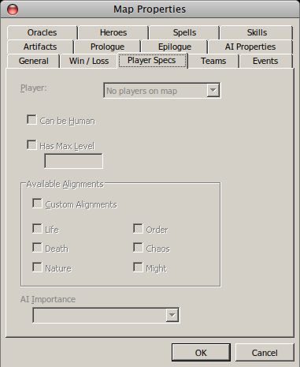

# Notes on Reverse-Engineering the Heroes 4 Map File Format

Background: [Heroes of Might and Magic IV] is a PC game released in 2002. It's
a strategy game with fantasy RPG elements, heavily D&D inspired, where you
control heroes and armies at both strategic and tactical scales.
You can read all about it at that link if you don't believe me.

[Heroes of Might and Magic IV]: http://www.heroesofmightandmagic.com/heroes4/heroesofmightandmagic4iv.shtml

I thought it would be fun to try to decipher the game's (binary) scenario file
format. This document chronicles my attempt. My motivation is partly practical:
I want to make maps for the game, but the scripting system is obstructed by an
obnoxiously clunky GUI (made for non-programmers, obviously). I'd love to be
able to write scripts for the game as textual source code that then gets
"compiled" into the map. That's probably a pipe dream, but in the short term I
can still have fun reverse-engineering some binary.

## Chapter 1: finding the end of the thread

I ran `hexdump -C` to inspect a simple map file I created.

The file begins with:

```
00000000  48 34 43 41 4d 50 41 49  47 4e 16 00 00 00 00 1f  |H4CAMPAIGN......|
00000010  8b 08 00 00 00 00 00 00  0b ed 5d 5f 77 db c6 95  |..........]_w...|
```

`H4CAMPAIGN` followed by some vaguely meaningful-looking bytes (though what
they mean, I can't say). The rest of the file was gibberish — just
random-looking binary. I was disappointed; I expected to see ASCII strings for
things like hero names and custom event messages.

The `1f 8b` bytes vaguely rang a bell, though. I wondered if the file was
gzip-compressed. Clearly, the whole thing was not a gzip file, due to the
`H4CAMPAIGN` prefix. So I tried slicing that off:

```sh
tail -c +11 my-map.h4c | gunzip | hexdump -C
```

No luck; I got `gzip: stdin: not in gzip format`. So I tried slicing more bytes
off: 12, 13, 14, 15, 16... aha!

**Apparently, map files consist of a 15-byte prefix followed by a gzipped
payload.**

Here is [the specification for the format of a gzip file](http://www.irc.org/ftp/irc/server/zlib/rfc-gzip.html#file-format)
for anyone curious. It's not really relevant for our purposes here, since we
can just use `gunzip` to get the raw Heroes data. But there you can read about
the significance of the `1f 8b` bytes.

## Chapter 2: setting up a laboratory

I decided that working with a "real" map file would introduce too many
confounding variables, so I created a completely blank, standard-size scenario
map with no underground level, and unzipped it.

```sh
tail -c +16 blank.h4c | gunzip | hexdump -C
```

Here is the beginning of what came out:

```
00000000  1d 00 02 00 98 00 01 bd  08 00 00 00 05 00 62 6c  |..............bl|
00000010  61 6e 6b 01 00 00 00 00  00 00 00 01 00 00 00 00  |ank.............|
00000020  00 00 00 00 00 00 00 00  00 00 00 00 ff ff 00 00  |................|
00000030  00 ff ff 00 00 00 ff ff  00 00 00 ff ff 00 00 00  |................|
00000040  ff ff 00 00 00 ff ff 00  00 00 ff ff 00 00 00 ff  |................|
00000050  ff 00 00 00 ff ff 00 00  00 ff ff 00 00 00 ff ff  |................|
00000060  00 00 00 ff ff 00 00 00  00 00 00 f8 00 ff ff ff  |................|
00000070  ff ff ff ff ff ff ff ff  ff ff ff ff ff ff ff ff  |................|
00000080  ff ff ff ff ff ff ff ff  ff ff ff ff 00 00 f8 00  |................|
00000090  00 00 00 00 00 00 00 00  00 00 00 00 00 00 00 00  |................|
*
000000b0  00 00 00 00 00 00 00 00  00 00 00 00 00 00 00 01  |................|
```

The first obvious thing is the text `blank` — apparently the name of the map,
derived from the filename I gave it. Interestingly, the string doesn't seem to
be null-terminated (it could be 1-terminated, but that seems unlikely).
However, before the string are the two bytes `05 00`, which look like a
[little-endian] 16-bit integer holding the length of the string.

[little-endian]: https://en.wikipedia.org/wiki/Endianness

To confirm, I changed the name of the map to
`It was the best of times, it was the worst of times` — a string of 51
characters. I expected those two bytes to change from `05 00` to `33 00` — 33,
of course, being the hexadecimal for 51.

Lo and behold:

```
00000000  1d 00 02 00 98 00 01 bd  08 00 00 00 33 00 49 74  |............3.It|
00000010  20 77 61 73 20 74 68 65  20 62 65 73 74 20 6f 66  | was the best of|
00000020  20 74 69 6d 65 73 2c 20  69 74 20 77 61 73 20 74  | times, it was t|
00000030  68 65 20 77 6f 72 73 74  20 6f 66 20 74 69 6d 65  |he worst of time|
00000040  73 01 00 00 00 00 00 00  00 01 00 00 00 00 00 00  |s...............|
```

SCIENCE!

(0x33 is, incidentally, also the ASCII code for the character `3`, which is why
`3` shows up in the ASCII display on the right.)

So, now we know that the name of a map can certainly be no longer than 65,535
characters. I'm sure you were dying to know what the limit was, right?

## Chapter 3: Exploring player configuration

After figuring out how the map name was represented, I shortened the name to
`It was the best of times, it was the worst of time`, just so the
bytes following the name would line up in nice 8-byte (CPU word-sized) chunks.
I wanted to know what those bytes meant — or at least, what pattern they
followed.

These are the bytes after the map name:

```
00000040  01 00 00 00 00 00 00 00  01 00 00 00 00 00 00 00  |................|
00000050  00 00 00 00 00 00 00 00  00 ff ff 00 00 00 ff ff  |................|
00000060  00 00 00 ff ff 00 00 00  ff ff 00 00 00 ff ff 00  |................|
00000070  00 00 ff ff 00 00 00 ff  ff 00 00 00 ff ff 00 00  |................|
00000080  00 ff ff 00 00 00 ff ff  00 00 00 ff ff 00 00 00  |................|
00000090  ff ff 00 00 00 00 00 00  f8 00 ff ff ff ff ff ff  |................|
000000a0  ff ff ff ff ff ff ff ff  ff ff ff ff ff ff ff ff  |................|
000000b0  ff ff ff ff ff ff ff ff  ff 00 00 f8 00 00 00 00  |................|
```

The first 16 bytes look like integers, either two 64-bit `1` ints or a pattern
of `1` `0` `1` `0` in 32-bit ints. I don't know what those numbers could mean.

Next come 8 or maybe 9 zero bytes — and then a repeating 5-byte pattern starts:
`ff ff 00 00 00`. This repeats 12 times. I don't know what the number 12 could
signify — it's not a number that shows up in any game mechanics I can think of.
However, the number 6 *is* significant (it's the maximum number of players per
map) so perhaps this is really a 10-byte sequence repeated 6 times.

I decided to test that hypothesis by changing the player settings, which
start out blank and uneditable:



(btw, I *love* that this is a screenshot of a Windows UI, with Mac OS X window
borders, taken on Linux. Computers are fun.)

In order to edit the player settings, I first had to put at least one hero
on the map. I hoped that this wouldn't confound my experiment...

And here is the result, after adding one female Sorceror (owned by the red
player) to the map:

```
00000000  1d 00 02 00 98 00 01 bd  08 00 00 01 00 01 00 00  |................|
00000010  08 32 00 49 74 20 77 61  73 20 74 68 65 20 62 65  |.2.It was the be|
00000020  73 74 20 6f 66 20 74 69  6d 65 73 2c 20 69 74 20  |st of times, it |
00000030  77 61 73 20 74 68 65 20  77 6f 72 73 74 20 6f 66  |was the worst of|
00000040  20 74 69 6d 65 01 00 00  00 00 01 01 00 00 01 00  | time...........|
00000050  00 00 00 00 00 00 00 00  00 00 00 00 00 00 00 ff  |................|
00000060  ff 00 00 00 ff ff 00 00  00 ff ff 00 00 00 ff ff  |................|
00000070  00 00 00 ff ff 00 00 00  ff ff 00 00 00 ff ff 00  |................|
```

It looks like something *above* the map name changed when I placed that hero.
See how the name got shifted over by 5 bytes?

It wasn't the result I was hoping for, but I was willing to follow this trail
wherever it led.

Here is the difference between the old (A) and new (B) beginnings of the map
data:

```
(A)
00000000  1d 00 02 00 98 00 01 bd  08 00 00 00 32 00 49 74  |............2.It|
(B)
00000000  1d 00 02 00 98 00 01 bd  08 00 00 01 00 01 00 00  |................|
00000010  08 32 00 49 74 20 77 61  73 20 74 68 65 20 62 65  |.2.It was the be|
```

It seems like maybe the zero byte preceding the `0x32` length prefix is a
length also. It's set to 1 in the new data, and then there are 5 bytes of data
before we see the length prefix for the map name. Those 5 bytes are:

```
00 01 00 00 08
```

Note that `0x08` is `00001000` in binary. Since there are therefore only two 1
bits in this whole record, it seems like at least part of it might be a bitmap.
But what those bits mean is anyone's guess at this point.

How do I know that the length is 1 byte and not 2 or more? Well, we saw earlier
that integers are little-endian in this format. Since (I presume) integers are
also fixed-width, there *can't* be a two-byte int there — if there was, there
would have to be another `00` before the `32` in (A).

<aside>

### Side note: length-prefixed data

A very common pattern in binary file formats is the length-prefixed array. When
you want to write an array of objects to the binary file, you first write the
length of the array, and then you write each object in the array. The advantage
of this technique is that it's extremely simple. The disadvantage is that any
program that wants to read the file has to know which type of object to expect
next — there is no metadata in the file to convey that information.

</aside>

It's interesting that the length is only one byte, because that means there
can never be more than 255 of these things, whatever they are. That *could*
mean this data is about players (of which there can be at most 6). It seems
possible, though unlikely, that it's about heroes instead. 255 seems like too
small a limit for heroes.

To investigate this question, I un-assigned the red player from our sorceror
hero. This brought the data back to version (A).

So perhaps those 5 bytes do indeed represent players! To confirm the hypothesis,
let's add a second player (blue).

```
00000000  1d 00 02 00 98 00 01 bd  08 00 00 02 00 01 00 00  |................|
00000010  08 01 01 00 00 08 32 00  49 74 20 77 61 73 20 74  |......2.It was t|
```

Et voilà, we see that that `01` changes to `02`, and there are now two
five-byte records following that number:

```
00 01 00 00 08
01 01 00 00 08
```

Could that first byte represent the player color? Maybe `00` means red and `01`
means blue?

I deleted the red hero and left only the blue one, and yes, it appeared to be
so. The length prefix went back to `01`, and the five-byte record following it
was:

```
01 01 00 00 08
```

I felt like I could keep going with this, so I cycled through all the player
colors and got:

| player color | hexadecimal code |
| ------------ | ---------------- |
| red          | `0x00`
| blue         | `0x01`
| green        | `0x02`
| orange       | `0x03`
| purple       | `0x04`
| teal         | `0x05`

So, to recap what we know so far:

- Player records are stored in a length-prefixed array. The length is one byte
  stored at location `0x0b`.
- Player records are 5 bytes long.
- The first byte is the player color.
- The array of players is followed by the length-prefixed map name. The length
  is two bytes, little-endian.

<style>
code {
    font-size: 85%;
}
aside {
    background: #fff;
    border: 1px solid #777;
    font-size: 93.25%;
    padding: 2em;
}
aside > :first-child { margin-block-start: 0 }
aside > :last-child  { margin-block-end: 0 }
</style>
