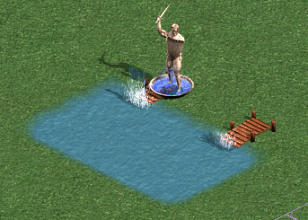

# How to Create an Unlimited Number of Unique One-Way Portals

One-way portals are cool, but there are only six colors, so if you're designing
a large map it's easy to run out of them. Here's how to create as many one-way
portals as you want:

- Make a path of water between the entrance and the exit at least two tiles
  wide. The water does not actually have to be passable by ships; e.g. there
  can be mountains on top of it.
- Place your two Ferries.
- Place the entrance tile of another adventure object on top of the Ferry that
  you want to be the exit. This makes the exit inaccessible from land.
