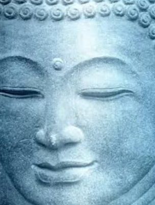

# OnThatPath Video Summaries

YouTube user [@onthatpath](https://www.youtube.com/channel/UCKuHpb6N1jLet2ZzNXntNmA) has as series of videos about meditation. I have found them to be an _extremely_ helpful supplement to the book [_The Mind Illuminated_ by Culadasa](https://www.goodreads.com/book/show/25942786-the-mind-illuminated) ([subreddit](https://www.reddit.com/r/TheMindIlluminated/)), but they are also a great standalone resource. Each video is short, but in total they are a couple hours, so I thought I'd summarize them here, both for my own reference and to help others.

I recommend watching all of the videos, and then referring to this page when you need a refresher to boost your meditation practice.

## Table of Contents

- [Playlist 1 (Right View)](https://www.youtube.com/playlist?list=PLfznqxq7ocuH2RUe5-3YFVuTn_3HzkCNE)
- [Playlist 2 (Meditation Instructions)](https://www.youtube.com/playlist?list=PLfznqxq7ocuFgKvwK_cUZfVZN-1x_25qu)

| Chapter | Video | Summary |
| ------- | ----- | ------- |
| Stress and Dissatisfaction (Part 1) | [Video](https://benchristel.github.io/yt/#i1izrpQqvP4) | [Summary](#why-you-feel-stress-and-dissatisfaction-in-life-part-1) |
| Stress and Dissatisfaction (Part 2) | [Video](https://benchristel.github.io/yt/#k2T9dxDmsS4) | [Summary](#why-you-feel-stress-and-dissatisfaction-in-life-part-2) |
| The Prognosis and Prescription | [Video](https://benchristel.github.io/yt#bMsTcqtWi1o) | [Summary](#how-to-permanently-be-free-from-stress-suffering--dissatisfaction-the-prognosis--prescription)
| Mindfulness | [Video](https://benchristel.github.io/yt#giDJNVPs014) | [Summary](#how-to-meditate-effectively-part-1-mindfulness)
| Booster Tools | [Video](https://benchristel.github.io/yt#B0IJ-f_cnVA) | [Summary](#how-to-meditate-effectively-part-2-booster-tools)
| What should your meditation feel like? | [Video](https://benchristel.github.io/yt#C1aCu4Cd3tw) | [Summary](#how-to-meditate-effectively-part-3-what-should-your-meditation-feel-like)
| Anapanasati overview | [Video](https://benchristel.github.io/yt#Swg8vt_t3GI) | [Summary](#tracking-meditation-progress-part-1-anapanasati-steps-overview)
| Śamatha steps | [Video](https://benchristel.github.io/yt#z8Wnm-crf1E) | [Summary](#tracking-meditation-progress-part-2-śamatha-steps-in-detail)
| Vipassana steps | [Video](https://benchristel.github.io/yt#KHhesuG9lhA) | [Summary](#tracking-meditation-progress-part-3-vipassana-steps-in-detail)
| The macro level | [Video](https://benchristel.github.io/yt#rjGAh7om7gc) | [Summary](#the-meditative-path-at-a-macro-level)

## Why You Feel Stress and Dissatisfaction in Life (Part 1)

<iframe width="560" height="315" src="https://www.youtube.com/embed/i1izrpQqvP4" title="YouTube video player" frameborder="0" allow="accelerometer; clipboard-write; encrypted-media; gyroscope; picture-in-picture; web-share" referrerpolicy="strict-origin-when-cross-origin" allowfullscreen></iframe>

Suffering, stress, baseline dissatisfaction, and anxiety can all be termed ***dukkha*** in Pali.

Dukkha has a cause, just like any other natural/physical process.

The causes of dukkha are **desire** (wanting more of something) and **aversion** (wanting less of something).

### How the creation of dukkha is experienced subjectively

The subjective world you're experiencing right now is a "3D space" of **awareness**. It's not a thing, but a process. Awareness is always present, and it encompasses *everything* you see/hear/feel/think/know right now.

> What isn't in awareness might as well not exist.
>
> —Culadasa

Starting from awareness, your mind goes through a series of causal steps to produce dukkha/suffering:

1. **Attention:** Your mind first starts _attention_, a process that selects objects out of awareness and analyzes them conceptually.
    Attention feels almost like an "arrow" or "flashlight" that emerges somewhere in your head and focuses on objects "out there" in reality.
2. **Sense of self:** Then, almost automatically, attention gives rise to subject/object duality. This is the feeling of being an observer inside your head. 
    Currently you probably take this feeling for granted and maybe even think it's just the way reality is. But this feeling of being a separate self is a mind-generated illusion!
3. **Concepts and feeling:** Once attention has focused on an object, conceptual analysis starts. The object gets a verbal label, and is associated with a "feeling tone" which ranges from pleasant, to neutral, to unpleasant. This "feeling tone" might be experienced somewhere in your chest.
4. **Craving:** This feeling tone, plus the sense of self from step 2, cause survival drives to kick in. If the feeling is pleasant, you crave more of it (desire), and if it's unpleasant, you want to run away from it or destroy it (aversion).
5. **Clinging:** If the craving isn't stopped within a few seconds, attention will start to "stick" to the object. It almost feels like the base of attention in your head is tightening up or being pulled toward the object.
6. **Reactive intention:** You start planning or even acting to get more of the thing you're craving (or get rid of it if the feeling is aversive). Whether the feeling is positive or negative, **reactive intention causes an increase in dukkha.** There is a short-term "halo" effect where reacting feels good, but once that wears off you are left with the dukkha that built up underneath.

The final link of the chain, _selfing_, is described in the next video.

### Why hedonism doesn't work

Most people's default philosophy is _hedonism._ I.e. they try to become happy by seeking what is pleasant, and avoiding what is unpleasant.

The problem is that even if you succeed in finding pleasure, it is short-lived, and then you are left with the dukkha that built up underneath.

## Why You Feel Stress and Dissatisfaction in Life (Part 2)

<iframe width="560" height="315" src="https://www.youtube.com/embed/k2T9dxDmsS4" title="YouTube video player" frameborder="0" allow="accelerometer; clipboard-write; encrypted-media; gyroscope; picture-in-picture; web-share" referrerpolicy="strict-origin-when-cross-origin" allowfullscreen></iframe>

(continued from the previous video)

7. **Mental state degradation / selfing:** The final link of the causal chain that creates dukkha is an increase in ego (the sense of being a separate self) and a degradation of your **mental state**.

### Mental state

Imagine we could rate your mental state from 0 to 100, where:

- 100 is perfect bliss and contentment
- 50 is an average, normal day
- 0 is suicidal depression

Example scenario: you start your day at state 50, but then someone criticizes you, and you **react.** This causes your mental state to degrade to 40. In a few minutes, the situation is over, but you still feel like your day is ruined for hours afterward.

Mental state degradation happens because of an increase in your sense of self. The more you feel like a separate self, the more anxious you will be, because you are constantly on the lookout for threats and resources ("me vs. the world" attitude).

### Feedback loop (poop-tinted glasses)

Mental state degradation feeds back into the dukkha-creating process discussed
earlier, in four places:

1. **Baseline dukkha** is increased by low mental states. When your mental
   state is degraded, you are more likely to feel depression, anxiety, and
   existential dread with no obvious cause. In higher mental states, on the
   other hand, you can deal with whatever life throws at you.
2. **Poop-tinted glasses:** the positive/neutral/negative feeling tone
   associated with the objects of attention tends more towards the negative in
   lower mental states, and more towards the positive in higher mental states.
3. **Increased reactivity:** low mental states make you more likely to have
   strong reactive intentions. In high mental states, you are less likely to
   react.
4. **Threshold of max dukkha:** in low mental states, reactive intentions
   create more dukkha and make your mental state even worse. In higher mental
   states, reacting doesn't harm your mental state as much.

The result of all these feedback loops is that both positive and negative
mental states are **self-reinforcing**.

### Attention is also conditioned

If you could control your attention, you could prevent craving and clinging and thereby prevent dukkha from arising!

Unfortunately, you can't control attention directly. Attention depends on causes and conditions like everything else. If you've ever tried to "meditate by force" (keep your attention on something for many minutes at a time) you know how little control you really have over it.

[Note: the right way to meditate is _not_ to try to force attention to do something, but to calm the mind so attention settles down on its own! —B.C.]

The cause of attention is **intention** or **"doership"**.

### Intention

**Intention or Doership** includes verbal, bodily, and mental intentions (thinking, planning, logical analysis). I.e. anything that "you" do intentionally.

These intentions are not controlled by a single, central self or "you"!

Instead, a better model of how intentions arise is a parliamentary model. You have a bunch of "sub-minds" that vote on your intentions, like MPs in parliament. They are subconscious and outside your direct control.

Subjectively, intentions feel almost like a buildup of tension in some part of your mind/body awareness.

- Verbal intentions feel like a nucleus of tension in your jaw or tongue.
- Bodily intentions — legs or arms.
- Mental intentions — forehead.
- Intentions can also feel like restlessness.

### Unawareness / Ignorance

Why would the MPs in your subconscious mind vote for intentions that are just going to cause dukkha? Because they aren't aware of the consequences of their actions. They can't clearly see the process by which dukkha happens and don't really "believe" the process is real.

By destroying this deep, subconscious ignorance, you can permanently get free of suffering.

### Buddhist concepts

This video and the previous video cover the **second noble truth**.

The causal chain that creates dukkha is **dependent origination**.

- Intention / doership is usually translated **formations**
- Attention — **consciousness**
- Reaction — **becoming**
- Mental state degradation — **rebirth**

The game of going up and down mental states = **samsara**.

## How to Permanently Be Free from Stress, Suffering, &amp; Dissatisfaction: The Prognosis &amp; Prescription

<iframe width="560" height="315" src="https://www.youtube.com/embed/bMsTcqtWi1o" title="YouTube video player" frameborder="0" allow="accelerometer; clipboard-write; encrypted-media; gyroscope; picture-in-picture; web-share" referrerpolicy="strict-origin-when-cross-origin" allowfullscreen></iframe>

Good news! It is possible to improve your [mental state](#mental-state), e.g. from level 50 (or lower) to 100.

However, even if you get to state 100, it's possible to fall back down.

The ultimate goal is to completely get out of the game of going up and down the mental states (***samsara***), by reaching ***nirvana***/***nibbana***/***moksha***.

The way to do that is by getting rid of the [ignorance](#unawareness--ignorance) which causes the [intentions](#intention) that start the dependent origination process.

Analogy: if you've burned your hand on a hot pan, you wouldn't intentionally touch it again, because you can clearly see the cause and effect. You don't even have to make a conscious effort to avoid it; it's automatic. Similarly, you can train your subconscious mind to avoid dependent origination instinctively, by showing it the causal chain.

### The prescription

Your mind's natural inclination is to rise up like a hot air balloon to mental state 100, unless something is pulling it back down.

You don't have to *do* anything to be happy.

In fact, trying to be happy tends to cause craving/clinging/reaction, which is counterproductive.

All you have to do is stop the chain of dependent origination, by breaking the causal links, and your mental state will rise up **on its own**.

### Breaking the links

There are several places we can break the dependent origination chain.

- **Virtue** - counters reaction
- **Letting go** - counters craving and clinging
- **Wholesome or effortless intentions** - counters subject/object duality
- **Mindfulness** - counters unawareness/ignorance

### Buddhist Concepts

This video covers the third and fourth noble truth.

The techniques for breaking the dependent origination chain are parts of the eightfold path.

- **Virtue** is similar to **right action** and **right speech**
- **Letting go** is similar to **right effort**
- **Wholesome or effortless intentions** is similar to **right intention**
- **Mindfulness** is similar to **right mindfulness**

Letting your mind rise to state 100 in meditation is similar to **right samadhi**.

## How to Meditate Effectively. Part 1: Mindfulness

<iframe width="560" height="315" src="https://www.youtube.com/embed/giDJNVPs014" title="YouTube video player" frameborder="0" allow="accelerometer; clipboard-write; encrypted-media; gyroscope; picture-in-picture; web-share" referrerpolicy="strict-origin-when-cross-origin" allowfullscreen></iframe>

### Overview

- Getting to the highest mental state (100) means your mind becomes calm and clear (_śamatha_).
- This clarity can then be used to gain insights into reality (_vipassana_).
- The insights lead to permanent wisdom and peace (_moksha_).

Calming the mind happens on its own if you just sit. You don't have to do anything, except _not_ run the dependent origination process.

Meditation = undoing dependent origination to release stress.

### What _not_ to do in meditation

Don't focus, concentrate, or try to force your mind to do something! That only causes clinging and slows down your progress.

### What to do in a sit

- Sit comfortably, but not so comfortably that you get sleepy.
- Use the [4 tools](#breaking-the-links) to undo dependent origination.
  - **Virtue**
  - **Let go**
  - **Wholesome or effortless intentions**
  - **Mindfulness**

The specific meditation techniques you use aren't as important, as long as you get the above fundamentals right.
Figure out which techniques work for you.

That said, a very useful technique is ***anapanasati*** (mindfulness of breathing).

### What is mindfulness?

If you can listen to a video lecture while also using 10–20% of your mental energy to just be aware that your body
exists, or be aware of the feeling of having a body, that's what mindfulness feels like.

- Mindfulness = the real-time experience of context beyond the thing you're currently focusing on.

[Terminology note: I'm not sure if this definition of mindfulness is distinct from awareness. Culadasa
clearly distinguishes between these terms, defining mindfulness as the optimal interaction between attention and awareness. I'll use the term *awareness* where OnThatPath uses *mindfulness* from here on. —B.C.]

### Anapanasati (mindfulness of breathing)

*Anapanasati* means being aware of the sensations that let you know you're breathing.

This awareness should feel alert, open, wide, and relaxed.

[To guard against sleepiness (what Culadasa calls *dullness*) I have found it helpful to visualize my
field of awareness expanding, like I'm looking out at a vast landscape, each time I relax with an exhale
(see below) —B.C.]

As you maintain awareness, let attention go wherever. It doesn't matter.

### Dealing with dullness

@onthatpath doesn't address the possibility of feeling sleepy or foggy-brained during meditation (what Culadasa calls _dullness_). YouTube user @tonightsmeaningless278 asked a question about this:

> How would I deal with strong and subtle dullness while practicing in this mode? Do you still recommend following the antidotes from \[_The Mind Illuminated_\]?

@onthatpath replied:

> Physical dullness =  lack of sleep. Mental dullness = lack of awareness. Mental dullness is an issue mostly pre-step 1 (negative mental states) or if dependent origination is allowed to happen via clinging. So, first get into step 1 at least, and then make sure you maintain enough mindfulness and keep preventing clinging.

## How to Meditate Effectively. Part 2: Booster Tools

<iframe width="560" height="315" src="https://www.youtube.com/embed/B0IJ-f_cnVA" title="YouTube video player" frameborder="0" allow="accelerometer; clipboard-write; encrypted-media; gyroscope; picture-in-picture; web-share" referrerpolicy="strict-origin-when-cross-origin" allowfullscreen></iframe>

You can use these tools in both meditation sits and daily life to boost your practice.

### OnThatPath's summary of the video

1. Maintain a simple and virtuous life.
2. No focusing in meditation (stay open and relaxed)
3. Set up peripheral awareness of your breathing
4. Effortless relaxed smile
5. Stay alert for tensions and drop them with an exhale.
6. Do steps 3–5 on cruise control.
7. Your mind will rise up to higher mental states on its own.

### Tool 1: Anapanasati

Covered in the [previous video](#anapanasati-mindfulness-of-breathing).

### Tool 2: Buddha's smile (effortless and wholesome intention)

- Relax your eyes into a gentle smile, like you see on Buddha statues.
  - [I like to _briefly_ imagine I'm smiling benevolently at a duckling or something cute like that, just to set the tone. Don't get caught up in thoughts and images, though. —B.C.]
- This will naturally cause **effortless and wholesome intentions** to arise.
- You can also establish a relaxed and non-restless mind more generally. **Go with the flow.**

- How effortless do you really have to be?
  - It's okay if it _feels like_ you are controlling your breathing. As long as you aren't intentionally choosing to control it, that's enough.
  - Exception: relaxing with an exhale. It's fine to control your breath here for one or two breaths.

### Tool 3: Letting go of tensions

As you meditate, you will experience **tensions**.

- They feel like nuclei or knots somewhere in your body, a bit like the feeling of a clenched fist. They can also feel like the body part is being pulled by something.
- They aren't physical muscle knots.

When you feel tension, drop your shoulders and relax with an exhale. Whether the tension goes away or not doesn't matter. Don't obsess over it and eventually it will disappear on its own.

A common place to experience these tensions is in your head, around your eyes or face. When you feel these, just relax your face/head area (this feels a bit like letting your head expand).

If your attention is clinging to an object, just relax and let it drop.

### Tool 4: Virtue in daily life

Virtue prevents you from accumulating too many obsessive thoughts, bad habits, and regrets, which create dukkha and slow down your meditation progress.

Things to avoid include:

- Stealing
- Lying
- Killing
- Cheating
- Fantasizing about any of the above
- [Doomscrolling —B.C.]
- [Perfectionism and obsessions —B.C.]
- [Attention-grabbing media —B.C.]
- [People you get into arguments with —B.C.]
- [Alcohol and dehydration —B.C.]

In short, un-virtue is anything you regret doing at the end of the day, or anything that makes your mind/body feel restless, foggy, or yucky afterward.

### Bonus tool: short "pre-sits"

- Take 5-minute meditation breaks throughout your day, in addition to your longer daily sit (of 30 minutes to an hour).
- Before doing a longer sit, spend a few minutes just chilling.

This will keep your mental state from degrading during the day, so you start your meditation from a good "base camp".

## How to Meditate Effectively, Part 3: What Should Your Meditation Feel Like?

<iframe width="560" height="315" src="https://www.youtube.com/embed/C1aCu4Cd3tw" title="YouTube video player" frameborder="0" allow="accelerometer; clipboard-write; encrypted-media; gyroscope; picture-in-picture; web-share" referrerpolicy="strict-origin-when-cross-origin" allowfullscreen></iframe>

### Metaphor: a bushfire defense system

Suppose you wanted to build a futuristic set of defenses around your house to protect it from bushfires. This might involve:

- Installing a force field around your house
- Humidifying the air inside the force field
- Using autonomous drones to put out any fires that start.

During meditation, we can defend our mental state against dependent origination in a similar way.

- Set up [mindfulness of breathing](#anapanasati-mindfulness-of-breathing). This is analogous to the force field.
- Establish [wholesome and effortless intentions](#tool-2-buddhas-smile-effortless-and-wholesome-intention) using a slight smile. This is analogous to the humidifier.
- Be alert for clinging/reaction and [let go](#tool-3-letting-go-of-tensions) of them when they arise. This is analogous to the drones that put out fires.

After letting go of tensions, take a moment to re-establish your mindfulness and intentions, since these can be disrupted by dependent origination.

### What your practice should look like

(this section is a summary of the above and [the previous video](#how-to-meditate-effectively-part-2-booster-tools))

## Tracking meditation progress part 1: Anapanasati steps overview

<iframe width="560" height="315" src="https://www.youtube.com/embed/Swg8vt_t3GI" title="YouTube video player" frameborder="0" allow="accelerometer; clipboard-write; encrypted-media; gyroscope; picture-in-picture; web-share" referrerpolicy="strict-origin-when-cross-origin" allowfullscreen></iframe>

| Satipaṭṭhāna | Ānāpānasati | Tetrads |
| ------------ | ----------- | ------- |
| 1. Contemplation of the body | 1. Breathing long (Knowing Breath) | First tetrad
|                              | 2. Breathing short (Knowing Breath) |
|                              | 3. Experiencing the whole body |
|                              | 4. Tranquilizing the bodily activities |
| 2. Contemplation of feelings | 5. Experiencing rapture | Second tetrad
|                              | 6. Experiencing bliss |
|                              | 7. Experiencing mental activities
|                              | 8. Tranquilizing mental activities |
| 3. Contemplation of the mind | 9. Experiencing the mind | Third tetrad
|                              | 10. Gladdening the mind |
|                              | 11. Centering the mind in samadhi |
|                              | 12. Releasing the mind |
| 4. Contemplation of Dhammas  | 13. Contemplating impermanence | Fourth tetrad
|                              | 14. Contemplating fading of lust |
|                              | 15. Contemplating cessation |
|                              | 16. Contemplating relinquishment |

The purpose of going through these 16 "steps" is:

1. to make your mind clear and calm, so you can then
2. see reality as it is (insight), and ultimately
3. attain durable wisdom (nirvana/moksha).

The first 12 steps are śamatha (calming) steps. The last 4 steps are vipassana (insight) steps.

Ultimately, you need to go through all 16 steps in a single sit.
But at first, your practice will focus on simply getting to the highest step you can.

Example: when you first start meditating, you'll spend your whole 30-minute sit in step 1.
But after a week or so, your mind will get used to step 1, and you'll be able to move on to step 2
before the end of your sit.

Each sit, you will advance through the steps starting from step 1.

### How to progress?

In each step, your attention will tend to cling to a particular phenomenon.

After you have gotten used to the phenomenon (dispassion) you will be able to let go of it,
and then you will ***automatically*** advance to the next stage.

There is nothing you have to "do" in meditation except stay mindful of what attention is
clinging to and allow it to move on when it's ready.

## Tracking meditation progress part 2: Śamatha steps in detail

<iframe width="560" height="315" src="https://www.youtube.com/embed/z8Wnm-crf1E" title="YouTube video player" frameborder="0" allow="accelerometer; clipboard-write; encrypted-media; gyroscope; picture-in-picture; web-share" referrerpolicy="strict-origin-when-cross-origin" allowfullscreen></iframe>

| During step... | You will experience... | In...
| ----------- | ---------- | ---------
| 1. Breathing long | Physical breath sensations | Nose or abdomen
| ("purifications") | Disturbing memories and thoughts
| 2. Breathing short | Breath sensations becoming less distinct | Nose or abdomen
| 3. Experiencing the whole body | Expansion &amp; contraction | Torso, arms, face
| 4. Tranquilizing the bodily activities | Bodily sensations become less distinct | Torso, arms, face
| 5. Experiencing rapture | Piti (involuntary movements; fluttering, throbbing, or bubbling) | Chest, arms, hands
| 6. Experiencing bliss | Pleasant calm | Chest, arms
| 7. Experiencing mental activities | Thoughts, images, self-talk. Churning "energy currents" | Lips, palate, jaw
| 8. Tranquilizing mental activities | Thoughts calm down |
| 9. Experiencing the mind | Breath sensations | Forehead, eyes, bridge of nose
| 10. Gladdening the mind | Piti, brightness | Center of head, visual field
| 11. Centering the mind in samadhi | (Jhanas) |
| 12. Releasing the mind | Tension &rarr; Dukkha and sense of self decrease | Center of head

## Tracking meditation progress part 3: Vipassana steps in detail

<iframe width="560" height="315" src="https://www.youtube.com/embed/KHhesuG9lhA" title="YouTube video player" frameborder="0" allow="accelerometer; clipboard-write; encrypted-media; gyroscope; picture-in-picture; web-share" referrerpolicy="strict-origin-when-cross-origin" allowfullscreen></iframe>

### 13 locations:

|             | Body part
| ----------- | ---------
| 1           | Hands and legs
| 2           | Chest
| 3           | Jaw
| 4           | Forehead (Perceptions)
| 5           | Hips (Intentions)
| 6           | Jaw (Intentions)
| 7           | Top of head
| 8–12        | Sense of observer
| 13          | Right side of chest

### Vipassana stages:

| Ānāpānasati       | OnThatPath stage | Insight        | Phenomena
| ----------------- | ---------------- | -------------- | --------------
| 13. Contemplating impermanence   | 1 | Impermanence   | Wave-like
| 14. Contemplating fading of lust | 2 | Dukkha / D. O. | Distraction, dullness, doubt
|                                  | 3 | Disgust        | Aversion
|                                  | 4 | Dispassion     | Equanimity
| 15. Contemplating cessation      | 5 | Nirvana        | Unease, heart racing &rarr; sudden darkness &rarr; peace
| 16. Contemplating relinquishment | 6 | Letting go     |
|                                  | 7 | Fruition       |

[My first experience of nirvana was weird. I burst out laughing and fell over.
I felt like I had just been told the [cosmic joke](../posts/cosmic-joke/). I
laughed with recognition — and relief. Recognition, because what a moment ago
had seemed alien had, with a slight perspective shift, resolved itself into
something familiar. Relief, because suddenly I understood that nothing could
possibly go wrong. —B.C.]

## The Meditative Path at a Macro Level

<iframe width="560" height="315" src="https://www.youtube.com/embed/rjGAh7om7gc" title="YouTube video player" frameborder="0" allow="accelerometer; clipboard-write; encrypted-media; gyroscope; picture-in-picture; web-share" referrerpolicy="strict-origin-when-cross-origin" allowfullscreen></iframe>

In the previous videos, we discussed the "micro" level of meditation:

- What to do during a sit
- A bit about what to do in daily life

This video is about the macro level: the stages you go through on the way to a good and happy life.

| Stage | View | Work | Daily Life | Formal Sit | Goal | How long?
| ----- | ---- | ---- | ---------- | ---------- | ---- | ----------
| -1. Worldy | [Hedonism](#why-hedonism-doesnt-work) | See that pleasure is fleeting | — | — | Develop enough dispassion to work on internal happiness | Decades
| 0. Intro to internal happiness | Fixation on methods | Try your best | — | Use methods | See that methods alone don't work well | &lt; 1 year
| 1. Intro to foundations / Dhamma | [Dependent origination](#how-the-creation-of-dukkha-is-experienced-subjectively) | Find learning resources | [Pre-sits](#bonus-tool-short-pre-sits) | Undoing D.O. | Confidence in foundations | 1 week
| 2. Mundane Dhamma | Experiential understanding of D.O. | Find a mentor, fix techniques and view | Simplify life when convenient | Reach higher mental states | Less clinging to methods | &lt; 2 months
| 3. Supramundane-leaning Dhamma | See danger in samsara, urgency | Prioritize meditation | 5 precepts | Consistent śamatha, start vipassana stages | path attainment | &lt; 1 week
| 4. Supramundane Dhamma | Instinctively see 3 fetters[^1] creating dukkha | Sprint towards the goal, stick to early Dhamma, don't philosophize | 5 precepts; avoid fetters | Repeat all 16 anapanasati steps | Stream entry | ~3 months
| 5+. Other fetters |   |   | Sense restraint

[^1]: The fetters are: 1. belief in a self (Pali: sakkāya-diṭṭhi); 2. doubt (vicikicchā); 3. attachment to rites and rituals (sīlabbata-parāmāsa); 4. sensual desire (kāmacchando); 5. ill will (vyāpādo or byāpādo); 6. lust for material existence, lust for material rebirth (rūparāgo); 7. lust for immaterial existence, lust for rebirth in a formless realm (arūparāgo); 8. conceit (māna); 9. restlessness (uddhacca); 10. ignorance (avijjā). Source: [Wikipedia](https://en.wikipedia.org/wiki/Fetter_(Buddhism)).

### Traps

- Stage 0: the "good meditator" trap.
  - Pleasant phenomena
  - Jhanas
  - Non-dual experiences
- Stages 1–4: contemporary sources
  - Use early Buddhist teachings instead.
  - Contemporary teachings are typically addressed to people in stage 0.
  - Feel free to use contemporary sources after stream entry.
- Stage 4: focusing too much on interesting experiences and philosophies.
