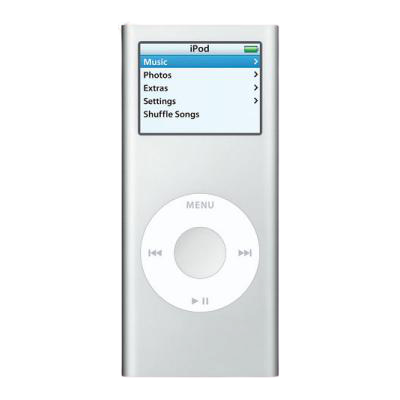

# Interlude 1

these 15 properties are derived from Christopher Alexander’s study of structures that have the quality he called **life**. This lifelike quality connects to biological life in at least three ways:

*   Its structure bears a mathematical resemblance to that of biological life: e.g. it is fractal (see [**levels of scale**](01-levels-of-scale.html)) and replete with **local symmetries**.
    
*   It makes us feel more “alive” in its presence: that is, more comfortable, more free to be truly ourselves, and more aware that by being ourselves we are connecting with something eternal that is shared by all humanity.
    
*   It correlates with structures that _work well_ — structures that are stable, self-maintaining, and able to grow and evolve. This last point is the strangest, the hardest to grapple with rationally, and possibly the most contentious. It is also the one I find most interesting for the purposes of software development.
    

If we can reach this quality in software systems — if we can make software that is “alive” in this sense — then we will have made something really worthwhile: software that fits us, that can grow with us, and that makes us feel at home.

This is not a hypothetical: the quality of life in software _has_ been reached, probably thousands of times, in the last few decades. The problem is that most of the systems that had it are no longer part of our daily lives. Either they are gone forever, or else (at best) they are museum pieces.

<figure>

<figcaption>Self in hardware: the iPod Nano (2nd generation).</figcaption>
</figure>

The problem with good software is that it fits us so well, its quality is unnoticeable. We rarely think of it, or realize how much it’s doing for us, until it is gone. As Zhuangzi said, a comfortable belt is one you forget you’re wearing.[^1]

[^1]: This doesn’t mean it’s impossible to notice or appreciate good software, just that it takes a bit more effort to notice than bad software. E.g. web browsers are very good these days — so good that I bet you rarely think about how much they’re doing for you. I also do not mean to imply that every program or app is either all-good or all-bad. Obviously some parts and features of a program can be better than others. The problem I see is that we seem just as eager to replace good features with bad ones as vice versa.

As humanity exits the railgun of progress that was the twentieth century, one of our many challenges will be to create economic systems that allow us to let things be, when we don’t yet know how to improve them further. Maybe I’ll write more about this someday. At present, I don’t really have any concrete suggestions.

<nav class="centered-text">{{prev}} | {{next}}</nav>