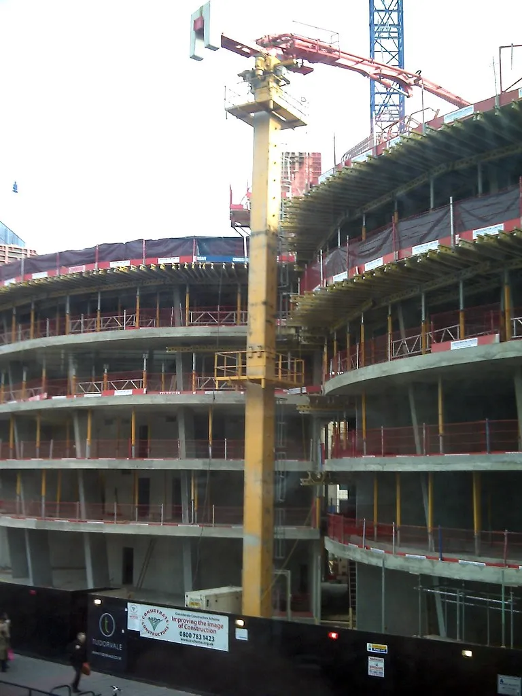

# Interlude 2

Why do the fifteen properties, and the feeling of life that accompanies them, show up so rarely in modern places and things? And why is software, the most modern of all media, the one venue where the fifteen properties _do_ regularly appear?

Here is my guess: the fifteen properties arise in situations of extreme economy, where the design is constrained by the need to extract as much value as possible from some precious resource (e.g. materials or labor). In the modern developed world, these resources are abundant. In fact, they are so <em>hyper</em>abundant, relative to the practical demands placed on our buildings and artifacts, that we can afford to waste them. The bureaucratic and technocratic systems that create the built environment today are, accordingly, ludicrously inefficient.

<figure style="--fig-width: 400px">

<figcaption>
&quot;<a href="https://www.flickr.com/photos/37031529@N00/3238264011">concrete pump on building construction site</a>&quot; by <a href="https://www.flickr.com/photos/37031529@N00">fsse8info</a> is licensed under <a href="https://creativecommons.org/licenses/by-sa/2.0/?ref=openverse">CC BY-SA 2.0</a>
</figcaption>
</figure>

Note that there seems to be a paradox here: the modern economy is highly efficient at _distributing_ resources. But it is not efficient at _using_ resources. This isn’t actually a paradox, though; it’s exactly what you should expect in an environment of hyperabundance. The challenge, in such an environment, is not figuring out how to use resources efficiently, but figuring out how to use them _at all_.

Imagine a startup that receives an influx of investment. Previously, they were operating on a shoestring, but now they have boatloads of cash. Their constraint shifts; it’s no longer “how can we stretch our money as far as possible,” but “how can we hire fast enough and scale up fast enough to return a profit to our investors?”

The twentieth-century economy, broadly speaking, is like this startup. A massive influx of resources (in the form of cheap fossil fuel energy), coupled with a population explosion, created an environment where success and power flowed to those who could spend resources the fastest. I’d bet that this can’t, and won’t, go on forever. But at least for now, it’s the situation we’re in.

Christopher Alexander was a harsh critic of the architecture that emerged from this 20th-century milieu. But his own critics are quick to point out that the examples he gives of _good_ architecture (i.e. living structure) tend to be _old_. They see living structure as a relic of a bygone era, and dismiss Alexander as hopelessly nostalgic. But the thing that stands out to me about Alexander’s examples is not their age, but their _efficiency_. One of the characteristics of the living structures that Alexander analyses is that their elements seem to resolve many forces simultaneously. Each center in the design is doing multiple things.[^1]

<figure class="bleed">

<figcaption>
&quot;<a href="https://www.flickr.com/photos/8185633@N07/3724578703">Dales Field Walls</a>&quot; by <a href="https://www.flickr.com/photos/8185633@N07">tj.blackwell</a> is licensed under <a href="https://creativecommons.org/licenses/by-nc/2.0/?ref=openverse">CC BY-NC 2.0</a>.
</figcaption>
</figure>

Here is a simple example of a living building process: a farmer in England clears the stones from their field, and builds a wall with them, to keep their sheep in. They don’t throw the field-stones away and then buy wall-building materials from somewhere else. They work with what’s on site. The building process is a simple matter of reshaping the material that is already present: moving stones from a place where they are harming the system to a place where they can help it.

Contrast this straightforward process with the way construction typically works in today’s globalized economy. Resource extraction, design, and construction are separate and abstracted from each other. Materials and fuel might travel halfway around the globe before arriving at a construction site. Huge projects are funded by investors who have never even visited the area where the construction is to take place. And when modern buildings are torn down (as they inevitably are, mere decades after being built) their materials go to landfill. These processes generate enormous wealth. _But they are also enormously inefficient in their use of materials and labor_. They only make sense in an environment of hyperabundance.

Why has the hyperabundance of the modern economy affected the software industry less than the construction industry? Why do ideas like **cross-functional teams**, **continuous improvement**, **feedback loops**, and **craft** remain relevant to us? I think there are a few reasons. But first, I think it’s worth pointing out that computing resources (CPU, memory, disk space, network bandwidth) _are_ hyperabundant, and we are, as you might expect, wasting them profligately. Various commentators have criticized the software industry for this waste. [Casey Muratori](https://www.youtube.com/@MollyRocket), for one, [loves to rag on programmers for wasting CPU cycles](https://www.youtube.com/watch?v=tD5NrevFtbU).[^2] He’s not wrong (about the waste) but what he doesn’t acknowledge is that CPU time usually isn’t the limiting factor on software’s success. In our current economic environment, wealth will generally accrue to those who can waste more CPU than their competitors.

So, what are the inputs to software development that _aren’t_ hyperabundant? In other words, what are the constraints we’re optimizing for when we do things that create the fifteen properties?

In my experience, the constraints tend to be:

*   How quickly a programmer can figure out how the software works and how to change it
*   How many programmers you can hire
*   How efficiently you can distribute work among those programmers.
    

These constraints come, respectively, from three more fundamental ones:

*   The working memory and processing ability of a human brain
*   The supply of programmers in the world
*   [Amdahl’s Law](https://en.wikipedia.org/wiki/Amdahl%27s_law), which says that as you parallelize a task among more and more workers, the total time taken approaches the time required for coordination.
    
These constraints aren’t likely to go away anytime soon.

I believe that Alexander’s fifteen properties are relevant for software developers because they allow us to operate efficiently within these constraints. They help us conserve our cognitive resources, and they allow multiple teams to work on the software in parallel. Exactly _why_ and _how_ they work is a bit of a mystery, though. That’s the mystery I’m trying to solve in this essay.

[^1]: This reminds me of a proverb about the game of [Go](https://en.wikipedia.org/wiki/Go_(game)), which says that every move you make should be doing two (or more) things at once. It also reminds me of Kent Beck’s principle of **mutual benefit**, from _Extreme Programming Explained_.

[^2]: Even though Casey criticizes “clean code,” it’s worth noting that his code (exemplified in the linked video) has the Alexandrian properties, including **levels of scale** and **symmetry**, and that his overall development practice is _deeply_ adaptive, incremental, and empirical. The 15 properties are not just about clean code or readability — they are about efficiency in the broadest sense.

<nav class="centered-text">{{prev}} | {{next}}</nav>