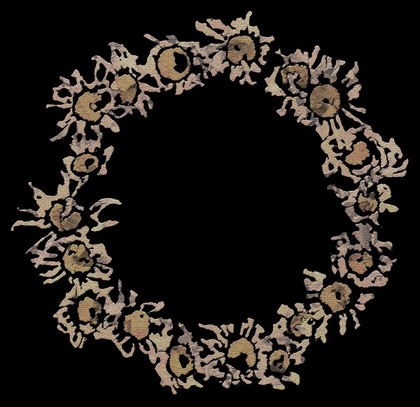

# 13. The Void

<figure style="--fig-width: 400px">

<figcaption>Album art from <em><a href="https://ingowanring.bandcamp.com/album/compendium-free-download">Compendium</a></em> by <a href="https://ingowanring.bandcamp.com/">In Gowan Ring</a></figcaption>
</figure>

A **void** might seem intuitively to be the opposite of living structure — empty space is about as dead as you can get. However, the purpose of a void is not to remain void, but to create an environment where life can bloom. This happens in two ways:

*   Smaller, temporary structures can fill in the void. This happens, e.g. in a town square, which might be filled at different times with people, vehicles, tables, or market stalls.
    
*   The void can form a [contrast](https://bensguide.substack.com/i/144510109/contrast) with finer structures at its margin or in its center. The contrast intensifies the life of the whole configuration.
    

Christopher Alexander said of voids that

> differentiation of minor systems almost always occurs in relation to the “quiet” of some larger and more stable system

and so it is in programming. The most significant systems in programming are also the quietest. Operating systems and programming languages are glacial, graceful beasts. The slowness of change in these systems creates the conditions for life — i.e. software applications — by providing a stable platform on which they can grow without being constantly disrupted. Innovation can bloom when platforms change slowly, and are unopinionated, quiet, and “empty.”

A programming language or library creates a metaphorical void in another way: it defines a space of hypothetical or potential programs, and this space “wants” to be filled by living structure. For more on this idea, I recommend watching Sarah Perry’s excellent and mind-bending talk “How to See Voids.”

Alexander thought voids had a spiritual quality - the sacredness of the void is communicated through its utter quiet. I don’t really know how to create this quality in code — except, perhaps, through the next property, _simplicity and inner calm_.

<nav class="centered-text">{{prev}} | {{next}}</nav>