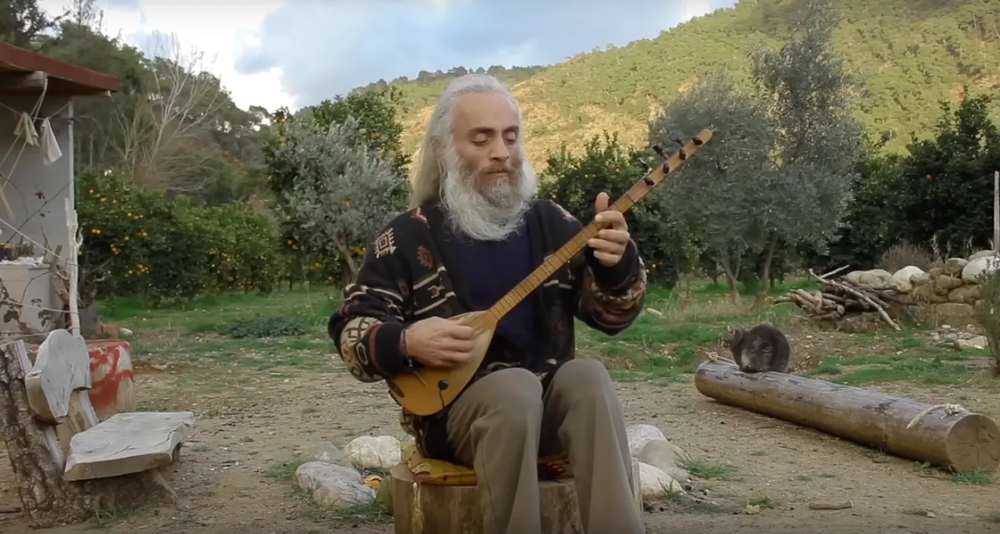

# 14. Simplicity and Inner Calm

<figure style="--fig-width: 100%">

<figcaption>
Still image from <a href="https://www.youtube.com/watch?v=cIMKJ43TFLs">Özgür Baba - Dertli Dolap</a>
</figcaption>
</figure>

One property that consistently marks the code of master programmers is **calm**.

Novices’ code tends to be tortuous: full of surprises, complexities, and odd bits sticking out. Data gets transformed and then untransformed a moment later. The call graph feels like a maze. APIs aren’t orthogonal; every method call seems to have side effects that often have to be compensated for or explicitly prevented. The whole thing feels feverishly, frantically busy — yet not much is actually accomplished.

Dysfunctional software development systems have the same frantic feeling. Constant firefighting, miscommunication, elaborate plans and Gantt charts, blame, unclear priorities, and a general miasma of despair pervade teams cobbled together by managers who don’t really have a clue how to make software development work.

Calm is the opposite. Calm is about working with unhurried efficiency, doing just what is needed and then stopping. The masters make this look easy, but it takes practice.

Whenever I think about simplicity and calm, I’m always reminded of this story from Zhuangzi:

> Ting the cook was cutting meat free from the bones of an ox for Lord Wen-hui. His hands danced as his shoulders turned with the step of his foot and bending of his knee. With a shush and a hush, the blade sang following his lead, never missing a note. Ting and his blade moved as though dancing to “The Mulberry Grove,” or as if conducting the “Ching-shou” with a full orchestra.
> 
> Lord Wen-hui exclaimed, “What a joy! It’s good, is it not, that such a simple craft can be so elevated?”
> 
> Ting laid aside his knife. “All I care about is the Way. If find it in my craft, that’s all. When I first butchered an ox, I saw nothing but ox meat. It took three years for me to see the whole ox. Now I go out to meet it with my whole spirit and don’t think only about what meets the eye. Sensing and knowing stop. The spirit goes where it will, following the natural contours, revealing large cavities, leading the blade through openings, moving onward according to actual form — yet not touching the central arteries or tendons and ligaments, much less touching bone.
> 
> “A good cook need sharpen his blade but once a year. He cuts cleanly. An awkward cook sharpens his knife every month. He chops. I’ve used this knife for nineteen years, carving thousands of oxen. Still the blade is as sharp as the first time it was lifted from the whetstone. At the joints there are spaces, and the blade has no thickness. Entering with no thickness where there is space, the blade may move freely where it will: there’s plenty of room to move. Thus, after nineteen years, my knife remains as sharp as it was that first day.
> 
> “Even so, there are always difficult places, and when I see rough going ahead, my heart offers proper respect as I pause to look deeply into it. Then I work slowly, moving my blade with increasing subtlety until — kerplop! — meat falls apart like a crumbling clod of earth. I then raise my knife and assess my work until I’m fully satisfied. Then I give my knife a good cleaning and put it carefully away.”
> 
> —Translated by Sam Hamill and J.P. Seaton (_The Essential Chuang Tzu,_ 1998)

[Elsewhere](https://github.com/benchristel/benchristel.github.io/wiki/PivotalFeedbackAndGrowth), I wrote:

> Like the master butcher of Zhuangzi's parable, who cuts the meat where it comes apart naturally and so never blunts his knife, the engineer's goal is to see the structure of the problem as it really is, and then simply lay the pieces side by side. To an observer it seems there is almost no need to cut; no need for a knife. The problem flakes apart under the gentlest effort like perfectly cooked fish.

Here is an example of how this applies to programming. Consider the task of parsing C-style string literals out of a file. A novice programmer might search for strings by looking for quote characters, then looking for backslashes preceding them to figure out whether they are escaped. And then looking for backslashes preceding the backslashes, to figure out whether the backslashes are escaped, in which case the quotes should actually be treated as string delimiters…

A master will probably use a regular expression like this (JavaScript):

```
const cString = /"([^"\n\\]|\\.)*"/g
```

This expresses the essential parts of the problem in a single (admittedly terse) line. A string consists of a double quote, zero or more “source characters,” and a closing double quote. A source character is either:

*   any ASCII character except a double quote, newline, or backslash
    
*   a backslash followed by any ASCII character.
    

The process that evaluates this regex is as simple as its denotation: it grabs all the string literals in one pass, looking at each character only once.

This kind of simplicity is an ideal, rarely achieved. When it is achieved I think it often goes unrecognized, because the solution seems obvious, commonplace, as natural as if it had always existed. But, recognized or not, it _is_ an achievement. To find simplicity and calm is to create a part of nature — and thus to become one, for a moment, with nature itself. I can think of no higher goal in art than that.

<nav class="centered-text">{{prev}} | {{next}}</nav>