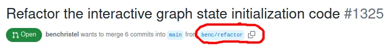
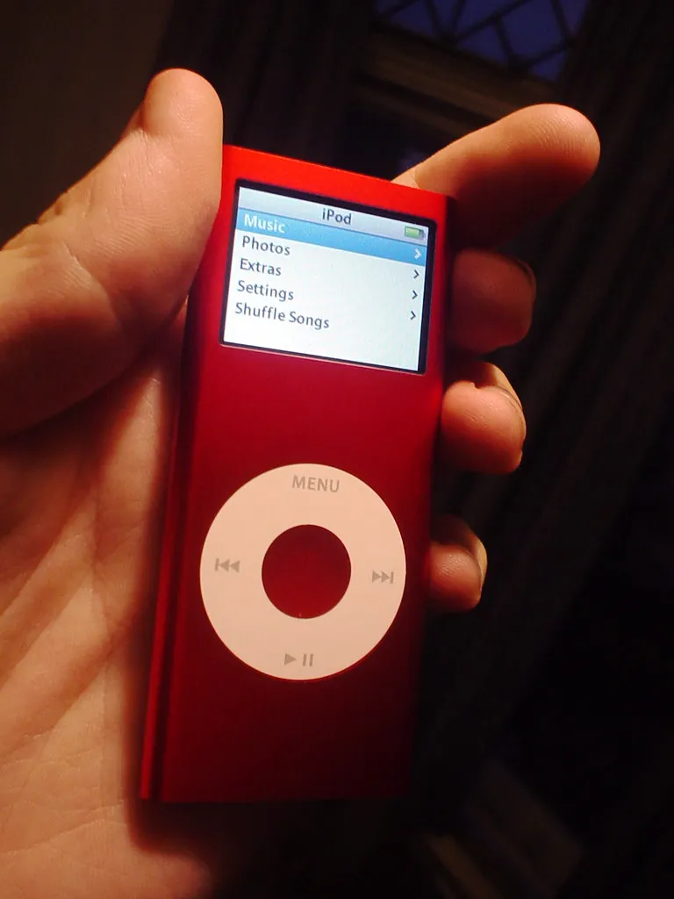

# 15. Not-Separateness

<figure style="--fig-width: 100%">

<figcaption>Life in a small café in Vietnam. By <a href="https://www.flickr.com/photos/69706441@N03">PiktourUK</a>, licensed under <a href="https://creativecommons.org/licenses/by/2.0">CC BY 2.0</a>.</figcaption>
</figure>

Programs interact with other systems, both human and digital, in the course of their development and use. Their perceived quality is largely a matter of how well they interface with those other systems.

Not-separateness — what we might call _good fit_ — is the property of a system whose interfaces are precisely in tune with the environment. Not-separate systems always arise via careful, incremental adaptation. The system grows out of the environment and responds to it, addressing its needs and accommodating its quirks.

Below is a simple example of not-separateness, from GitHub’s UI. At the top of every pull request, the branch name is displayed beside a button to copy it to the clipboard.

<figure class="bleed">

</figure>

The designers at GitHub know that users often want to copy branch names to paste into Git commands, so they make that as easy as possible. This design choice acknowledges several other centers in GitHub’s environment:

*   Programmers
    
*   Terminals
    
*   Git
    
*   Branch-based development workflows
    

The utility of this feature is thus deeply tied to the specific ways that programmers use both GitHub _and other development tools_. The user interface cannot be separated from the environment where it occurs.

Not-separateness isn’t just a property of GUIs, though; it also occurs in source code. Any time we write code, we’re creating the user interface that our future selves will use to understand and change the code. That interface needs not only to be comprehensible in the abstract, but to be comprehensible through the specific tools (e.g. editors and debuggers) that we actually use.

Here’s an example of how code can fit (or not fit) programmers’ tools: I was once on a team writing C++. We had a coding convention that dictated that all member variables should be prefixed with an underscore, like `_someName`. I suggested that we drop this rule, since our IDEs highlighted member variables in a unique shade of purple that made them easy to spot even without a special prefix. My teammates objected: some contributors to our open-source codebase might be using editors that didn’t have that feature. The prefix was for them, not for us. What seemed like good fit to me (accommodating our code style to the capabilities of _our_ tools) wasn’t a good fit in the bigger scheme of things.

The opposite of not-separateness is what we might call _stand-out-ness —_ a much sought-after quality in Silicon Valley. Only something that is _separate_ can be flashy and attention-grabbing. For this reason, software makers seem to favor separateness over not-separateness — they prioritize showroom appeal over actual usability. Bruce Tognazzini has [a great write-up](https://asktog.com/atc/the-third-user/) of the many ways Apple has done this over the years, optimizing its products for _buyers_ rather than long-term _users_. Many other companies are guilty of using the same tactic.

Of all the fifteen properties, then, not-separateness may be the hardest for Silicon Valley types to swallow. We want our software to stand out — not just to boost sales, but because on some level we all want, as Steve Jobs said, to “make a dent in the universe.” But what the universe needs is careful mending, not more dents. If ten thousand different people each start a world-changing revolution, the result is likely to be chaos, not utopia.

When products are deeply adapted to their context, innovation isn’t flashy or glamorous. It feels like doing the same old thing in a slightly different way. But the truth is, we never do the same thing twice in software. We are always adapting, refitting, testing out a different strategy or a different order of operations. These tiny innovations seem trivial at the moment of their conception, but over time they add up. They produce incredibly subtle, intricate designs that could never have been planned at the drawing board. And, more importantly, they produce software that users love.

By accommodating themselves to their context, not-separate programs become a kind of image of the forces in that context. Their shape is determined by users’ needs and desires, not the programmer’s ego. As a result, these programs have a special quality. When you use them, they seem to _just work_ the way you’d expect. They work so well, in fact, that most of the time you don’t even notice them.

But if for some reason you _do_ become aware of them, if you _do_ happen to look more deeply, you may be surprised to see the image of your own innermost self, like the imprint of your own thumb, staring back at you.

<figure style="--fig-width: 300px">

<figcaption>
&quot;<a href="https://www.flickr.com/photos/26572975@N00/268673268">Red iPod Nano</a>&quot; by <a href="https://www.flickr.com/photos/26572975@N00">Andrew*</a> is licensed under <a href="https://creativecommons.org/licenses/by-sa/2.0/?ref=openverse">CC BY-SA 2.0</a>.
</figcaption>
</figure>

<nav class="centered-text">{{prev}} | {{next}}</nav>