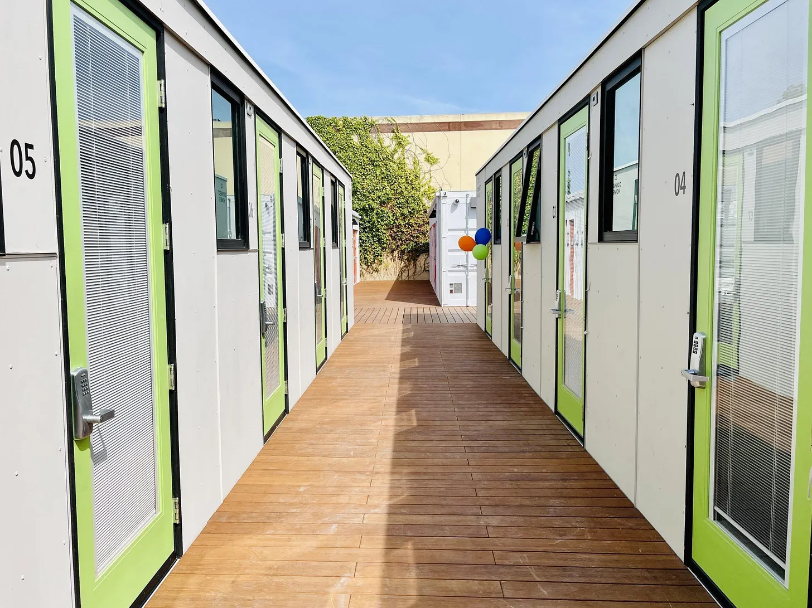
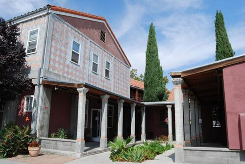

# An Extremely Cursory Summary of Alexandrian Thought

Christopher Alexander (1936–2022) was an architect-builder: he designed buildings and oversaw their construction. Most architects in the U.S. don’t work the way he did. They don’t get deeply involved in construction; they just draw up the plans and toss them over the fence to be built by someone else. Alexander, by contrast, concerned himself with every detail, down to tilework and trim. He hand-painted ornaments on some of his buildings himself.

<figure style="--fig-width: 300px">

<figcaption>Flower motif painted by Christopher Alexander on the wall of the Linz Café, in Linz, Austria</figcaption>
</figure>

The status quo of how buildings are constructed in the U.S. (and increasingly, all over the world) was deeply troubling to Alexander. He could see that the design-up-front, build-on-spec, tear-it-down-in-50-years approach created buildings that couldn’t adapt to the needs of their inhabitants, and often overran their budgets to boot. But more poignantly, he could see that these buildings were almost always ugly, devoid of feeling, and designed without deep care for the people who would live and work there.

<figure>

<figcaption>Homekey Mountain View, a Bay Area homeless shelter. Not by Christopher Alexander.</figcaption>
</figure>

Alexander spent his entire career in an unwavering quest for a solution to this problem, which culminated in the publication, in four volumes, of a 2,000 page essay that he called _The Nature of Order_. In this monumental work, he reimagines architecture from the ground up.

<figure>

<figcaption>The Julian Street Inn, an 85-bed homeless shelter in San Jose. Designed and built by Christopher Alexander.</figcaption>
</figure>

## Life

He starts with a simple observation about the built environment: **some places make us feel more comfortable, more whole, and more “alive” than others.** Not only that, but the things that make us feel alive seem almost to have a kind of life themselves. They are vibrant. They are personal. They seem, somehow, to have “the character of nature,”[^1] even when they are made by people.

[^1]: As Alexander put it in one of his earlier works, _The Timeless Way of Building_.

<figure style="--fig-width: 400px">

<figcaption>A fragmentary Turkish carpet from Christopher Alexander’s collection. Though the design is abstract, it feels almost like a living being in its power and majesty.</figcaption>
</figure>

To get a sense for what Alexander means when he talks about the life of a place or a thing, it is easiest to start with some examples.

The life that exists in the built environment is perhaps most acutely recognizable by its absence. Here is a place, typical of North America, that has very little life: a commercial parking lot.

<figure>

<figcaption>

"[Costco Parking Lot](https://www.flickr.com/photos/14913305@N00/39197810260)" by [Chris Hunkeler](https://www.flickr.com/photos/14913305@N00) is licensed under [CC BY-SA 2.0](https://creativecommons.org/licenses/by-sa/2.0/?ref=openverse).

</figcaption>
</figure>

Imagine stepping out of your car into this space. The hot sun glints off the rows of metal roofs, shimmering in the waves of rising air. Your muscles tense, and your face hardens ever so slightly toward an expression of grim resolve as you hustle over the pavement to wherever it is you’re going. Because you’re certainly not going _here_. This is a liminal space, a nowhere-place, a leftover, a necessary evil, an externality. It is alien to you, and you are alien to it. You are just passing through, and it instructs you, quietly but firmly, to move along.

Now let’s look at a place that has much more life: a courtyard filled with with trees, trellises, and café tables, tucked between lovable four-story buildings.

<figure style="--fig-width: 450px">

<figcaption>

"[View, cafe & courtyard](https://www.flickr.com/photos/49539505@N04/6042858166)" by [La Citta Vita](https://www.flickr.com/photos/49539505@N04) is licensed under [CC BY-SA 2.0](https://creativecommons.org/licenses/by-sa/2.0/?ref=openverse).

</figcaption>
</figure>

It’s a place where you might happily sit, in dappled shade, for hours, perhaps chatting with a friend, sipping a hot or cold beverage of your choice. Just sitting, people-watching, with your phone slumbering half-forgotten in your pocket.

Okay, you might say. One of these places is obviously designed to be nice; it has had a lot of money put into it. It looks like a hangout for rich people. The other is bare-bones, middle-class, utilitarian in the meanest sense. Might Alexander’s concept of “life” just be a proxy for “wealth?”

Alexander invites us to look deeper.

<figure>

<figcaption>

Lifeless buildings for the wealthy. "[Modern Apartments](https://www.flickr.com/photos/89461633@N00/5605540135)" by [Mdrewe](https://www.flickr.com/photos/89461633@N00) is licensed under [CC BY-ND 2.0](https://creativecommons.org/licenses/by-nd/2.0/?ref=openverse).

</figcaption>
</figure>

He shows many examples of places, like the apartments above, that represent huge investments of wealth, but have very little life. He also shows examples of the intense life that people can create even without a lot of money.

<figure class="bleed">

<figcaption>

Kensington Market, a historic multicultural neighborhood of Toronto. Photo by [Travis Estell](https://www.flickr.com/photos/35807342@N00), licensed under [CC BY-NC-SA 2.0](https://creativecommons.org/licenses/by-nc-sa/2.0/?ref=openverse).

</figcaption>
</figure>

He invites us to ask: what is the nature of the “life” we feel, or don’t feel, in each of these examples? What is its origin? It is possible to create it intentionally?

Alexander takes 2,000 pages to fully answer this question. But very briefly, his conclusions are:

*   that the origin of life in places is _structural_. There is something about the geometric arrangement of matter and space in these different places that makes us feel different degrees of life there. In addition, living structure is recursive: a place has life when it is made of smaller pieces and places that themselves have the geometry of life, and that work harmoniously together.
    
*   that living places _can only_ be created when planning and construction happen together. To create life, the plan must be able to adapt to the real facts on the ground — the real forces that shape people’s activities. Those forces can only be discovered when you are on the site, collaborating with the people who will be the building’s primary inhabitants.[^2]

[^2]: One way to get life, even with upfront planning, is to remodel the building after you’ve lived in it for a while. This is the approach that Stewart Brand focused on in his TV miniseries “[How Buildings Learn](https://www.youtube.com/playlist?list=PLrg__Ji1S58TnecKCIFNskj-Q3P2NV0pw).”

*   that life, contrary to what you might expect, does not have to cost a lot of money. Alexander did all kinds of projects, and was always extremely scrupulous about staying within his client’s budget. He firmly believed that the budget must be held sacred, and the scope and priorities of the project adjusted to make the best possible use of the available funds.[^3]

[^3]: Occasionally, this got him into trouble. In _The Nature of Order_ he relates the story of a client who wanted a [terrazzo](https://en.wikipedia.org/wiki/Terrazzo) floor in part of a house they were remodeling. In order to make the floor perfect, Alexander would have had to demolish the existing concrete slab and pour a new one. The client couldn’t afford it. So Alexander offered to install the terrazzo over the existing slab, warning the client that the terrazzo might sustain some cosmetic cracking as a result. The client agreed to this, and the project was completed within the budget. The terrazzo later cracked, as Alexander had predicted, and the client sued him over it. The judge ruled in the client’s favor, saying that Alexander should have refused to install the terrazzo if he couldn’t “do it right.” This is just one example of how Alexander’s agile philosophy clashed with prevailing assumptions about how architecture and construction should work.

## Centers

Alexander held a master’s degree in mathematics, and like any mathematician he sought crisp definitions. He wasn’t satisfied with a vague characterization of “life” as some quasi-mystical property of certain places.[^4] He wanted something concrete, something computable.

[^4]: In an earlier work, _The Timeless Way of Building_, he introduced the concept of life as “The Quality Without a Name,” explicitly refusing to define it exactly.

So he investigated the nature of the substructures that make up living places, and finally came to call those substructures **centers**.

I found Alexander’s concept of centers somewhat difficult to grasp when I first encountered it. However, now that I _do_ understand what centers are, I find them to be one of the most obvious and natural ideas there is. The only difficulty lies in the abstractness of the concept, because the word _center_ covers a huge variety of everyday structures and objects that we normally refer to with more specific words.

To see that you already understand what a center is, imagine a whirlpool in a stream.

<figure>

</figure>

What is a whirlpool? It's not a set of water molecules. The physical material that makes up the whirlpool is rapidly and constantly changing. It's also not an exact shape; the particular ripples in the water are constantly changing. You can’t draw an exact boundary around it, and it's not separable from the stream itself; you can't lift it out of the water and take it home with you.

Yet you can point to it. You can name it. If you come back the next day and the whirlpool is still there, you can say “it's the same one I saw yesterday.” If you know you can do all those things, then you know what a center is. A whirlpool is a center.

A center has an identity; we can point to it and say “that one,” and we can count how many there are. But a center is not always an isolated _object_. We can count the waves in a pond, the growth rings in a log, or the stitches in a knitted scarf, but while those structures are centers, they are not objects.

A center’s boundary is often fuzzy; we often cannot draw a hard line around a center and say “these points belong to the center, and those points don’t.” But we _can_ talk about the _degree_ to which any given point in space is associated with a center. And every center really does have a _center_ — the region where its presence is most intense, and least ambiguous.

(Some centers, especially artificial ones, are more object-like than the examples I’ve given so far. Pick any object you see around you; it’s a center too.)

Alexander defines centers recursively: because a center is a structure, not necessarily an object, it can only be made, in general, of other structures—other centers.

The way that centers come together to form larger centers is not arbitrary. In order for the whole to have life, the centers in it must be _organized_. They can’t clash or work at cross purposes—they have to intensify each other, to harmonize, to build up to something. Accordingly, there are only a few ways that centers can be composed in a living structure. Christopher Alexander identified approximately[^5] 15 of these ways.

[^5]: He emphasized that there was nothing special about the number 15, and that there were other ways of analyzing living structures that resulted in a different number, or a different categorization. But he was pretty sure that there were more than 2 or 3 ways for centers to create living structure, and nowhere near 100.

## Fifteen Fundamental Properties of Living Structure

Very briefly, here are the 15 ways that Alexander saw centers working together in living structures. For more detail, along with examples, see the trio of articles by Dave Hora linked here:

- [Nature of Order #1](https://patterns.architexturez.net/doc/az-cf-218793)
- [Nature of Order #2](https://patterns.architexturez.net/doc/az-cf-218794)   
- [Nature of Order #3](https://patterns.architexturez.net/doc/az-cf-218795)

1.  **Levels of Scale.** A larger center can be supported by or made up of smaller ones—usually about 1/4 to 1/2 its size. When this happens recursively, the centers in the whole structure form a hierarchy of scales.
    
2.  **Strong Centers.** One center can strengthen another by “pointing” toward it. Often one particularly strong center stands out as being _the_ center of the whole configuration.
    
3.  **Boundaries.** One center can intensify another by forming a boundary around it, making it more distinct from its environment while also connecting it to its environment.
    
4.  **Alternating Repetition.** A row of similar centers becomes more alive when the space between the centers is not merely leftover, but is a coherent shape in its own right. The effect is that one perceives two different kinds of center that take turns with each other. Alternating repetition is really (IMO) a special case of positive space, below.
    
5.  **Positive Space.** Neighboring centers become more alive when each has a coherent, positive shape that we can perceive as an entity. (This is basically what’s happening in that optical illusion that’s either two faces or a vase — the two interpretations feel equally likely because the centers are equally positive. Both are plausible foreground figures; neither is merely background.)
    
6.  **Good Shape.** A center can have a beauty all its own, which comes from simplicity, grace, and good proportions. This is the hardest property to define.
    
7.  **Local Symmetries.** A center gains life according to the number of locally symmetrical elements it contains. This is perhaps the easiest property to define mathematically, and Alexander did a series of experiments that demonstrated its contribution to people’s perception of life in centers.
    
8.  **Deep Interlock and Ambiguity.** A boundary between centers (see above) may be formed by the two centers “hooking into” one another like interlaced fingers. There may also be ambiguity about which center the boundary belongs to. The whole configuration feels most alive when centers don’t form a strict, unambiguous hierarchy, but rather a [directed acyclic graph](https://en.wikipedia.org/wiki/Directed_acyclic_graph), with many different overlapping patterns and groupings.
    
9.  **Contrast.** The whole configuration feels more lively when there is harmonious contrast (e.g. of color or texture) between neighboring centers.
    
10.  **Gradients.** When a certain property (sunlight, temperature, distance to downtown) varies continuously throughout space, the centers in that space will form some kind of _gradient_ (e.g. of varying window sizes or building types) if they are correctly adapted to their context. This property isn’t really about centers working together; it’s more about the adaptation of each individual center to its particular location.
    
11.  **Roughness.** Another property that’s about adaptation. When centers are really well adapted, geometric perfection (perfect grids, perfect rows) takes a back seat. Rigid global order feels sterile and dead because it prevents local adaptation.
    
12.  **Echoes.** Centers intensify each others’ life when they share family resemblances, when they seem to “go together.”
    
13.  **The Void.** Centers gain a more profound life in the midst of quiet, empty space—especially if the space is, itself, a coherent, bounded center.
    
14.  **Simplicity and inner calm.** Most of the other properties on this list seem to be telling us to fill structures with lots and lots of detailed little centers. This one says there’s a limit. Too much detail is just noise. We should only add detail that makes a net positive contribution to the life of the whole.
    
15.  **Not-separateness.** This is another property that’s really about adaptation. It says that a center can only really come to life by honestly responding to its actual context. It can’t be contrived or phony. It can’t be so “out there” that no one can make sense of it. It can’t be corny or cutesy. It shouldn’t feel awkward or out of place.

## Adaptation

Alexander derived his 15 properties by looking at a huge variety of structures and systems, both natural and human-made, that had the feeling he called “life.” These properties seemed _necessary_ for life, in the sense that things that lacked the properties always felt dead and sterile. But Alexander knew better than to claim that the properties were _sufficient_ for life — “just follow these 15 rules to design nice places.” It’s obviously not that simple.

So how do you actually do it? How do you design a building, or a neighborhood, that feels alive?

Alexander’s answer is that you don’t.

Life cannot be designed at the drafting table. It can _only_ come into being through a process analogous to the growth or evolution of biological living systems, in which each part gradually adapts to its context. It is this deep _adaptation_, more than any of the fifteen properties, that creates the feeling of life. The fifteen properties are the visible result of the adaptation process, but the result itself cannot be planned.

The reason it can’t be planned is that the “context” to which each evolving part is adapting is really all the _other_ parts of the emerging system, which are themselves adapting to everything else as the process unfolds. So we have a kind of infinitely-recursive, [Indra’s-net](https://en.wikipedia.org/wiki/Indra%27s_net) type situation where everything depends on everything else. This implies that a living whole cannot be constructed from pre-made parts, since there is no way for pre-made parts to adapt to each other. To have life, the system has to hoist itself into being by its own bootstraps.

If this sounds a bit like agile software development—well, there’s a reason for that. The two movements, Alexandrian architecture and software agility, are intertwined, with a history that goes back decades. I can’t do justice to that history in this post, so I’m just telling you: it’s there if you care to research it. Links are in the footnote.[^6]

[^6]: Starting points include [Alexander’s keynote talk at OOPSLA ‘96](https://www.patternlanguage.com/archive/ieee.html), Kent Beck’s _[Extreme Programming Explained](https://www.oreilly.com/library/view/extreme-programming-explained/0321278658/)_, Richard Gabriel’s _[Patterns of Software](https://www.dreamsongs.com/Files/PatternsOfSoftware.pdf)_, and the [Gang of Four](https://www.oreilly.com/library/view/design-patterns-elements/0201633612/) _[Design Patterns](https://www.oreilly.com/library/view/design-patterns-elements/0201633612/)_ [book](https://www.oreilly.com/library/view/design-patterns-elements/0201633612/).

## The Conundrum for Software Developers

Part of Alexander’s thesis is that buildings with the 15 properties don’t just look pretty, they actually _work better_, on a practical, mechanical, and sociological level. I find this extremely surprising, as he did and as I expect you do. The warm fuzzies we get from the _appearance_ of biological life can perhaps be attributed to our evolutionary heritage—our ancestors survived by seeking out places where plants and animals thrive, so we’ve inherited their affinity for the “character of nature.” It’s far less obvious why the same fifteen properties that characterize healthy biological life could predict the healthy functioning of a building — but it seems that they can.

Even more surprising is that the fifteen properties would appear in _healthy computer programs_, or in _healthy_ _software companies_. These systems seem completely divorced from biological life, and indeed from physical reality. They seem to be about as far from nature as you can get.

And yet, I have found that the fifteen properties _do_ appear in programs and software companies, and that when they appear it is a sign that the system is working well. When you grow software via an incremental, adaptive process, you get the fifteen properties, you get software that works better (for its users and developers), and you get the feeling of life. It happens consistently. Over and over, the fifteen properties show up in software systems that work well, and not in those that don’t work well. It seems, therefore, that there must be some common thread that links software systems, biological systems, and the built environment. But it is far from clear what that could be.

As I wrote in the [previous post](intro.html), something _really_ strange is going on here.

…and by that, I of course mean that something completely natural, ordinary, and self-consistent is going on, but we don’t yet have the tools or the language to properly conceptualize it or work with it.

To untangle the mystery, we'll have to take a deeper look at each of the fifteen properties, to see how they apply to both buildings and software. That investigation begins in the next post.

<nav class="centered-text">{{prev}} | {{next}}</nav>