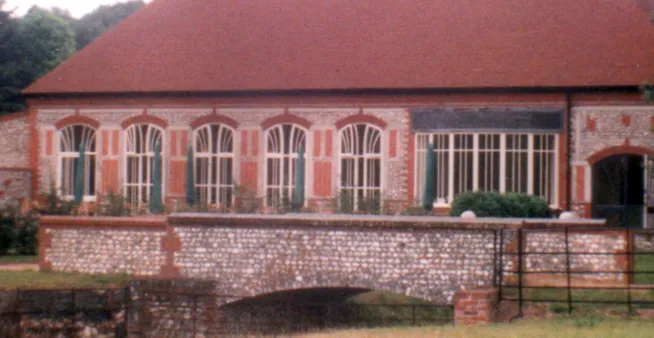

# Conclusion?

Posted January 2024, updated October 12th, 2025.

_Author's note: I originally planned for this chapter to be the conclusion of the present essay on Christopher Alexander. However, it ended up not being the conclusion. I don't think it even presents a particularly good way of looking at the question I’m trying to answer — namely, why the same fifteen properties of structure that characterize healthy natural systems and beautiful buildings also appear in maintainable, human-adapted software systems. It was only after I’d written several very different drafts of this chapter that I went combing through_ The Nature of Order _to see if Christopher Alexander had an answer to the problem I was struggling with. I discovered that he did, and that it was better than any of my answers. I describe C.A.'s answer in the next chapter._

_Rather than throw away my drafts, though, I thought I’d show a few of them to you — the top three “takes,” one after the other. I’m hoping that if I show you my thought process, it will prepare you (as it prepared me) for Alexander’s surprising solution._

## Take 1: Adaptation

_In this first take, I try to identify a common thread uniting software, buildings, and biological organisms: namely, that all these systems must adapt to their environments while maintaining their own internal order. The purpose of the 15 properties, in this view, is to enable the adaptation process to continue indefinitely, by keeping the system “whole” or self-consistent. I end by positing a relationship between self-consistency and optionality: I claim that only a self-consistent system has the flexibility to grow and change, and thus to adapt to future needs._

---

> Computer scientists have told me proudly that they consider computer programs the most complex objects designed by human beings. Yet, to date, there is little recognition of the following commonsense point: If indeed the programs are so complex, then it is likely that they, too, will be potentially subject to hundreds of thousands, perhaps millions of egregious mistakes of adaptation. Here I am not only talking about “bugs” — failures which stop a program from running altogether. I am talking about mistakes of adaptation, ways in which the program fails to do what it is supposed to do, fails to meet the needs of the people who use it, or is more awkward, more annoying, less useful, than it is supposed to be. If the analysis given in this chapter is correct, then it is fair to say that truly successful programs can only be _generated_, and that the way forward in the next decades, towards programs with highly adapted human performance, will be through programs which are generated through unfolding, in some fashion comparable to what I have described for buildings.
> 
> —Christopher Alexander, _The Process of Creating Life_, p. 198

I began this essay on Christopher Alexander with a question — or rather, with a startling and puzzling observation. Namely: that the fifteen properties of structure that characterize both living systems and lovable places also appear in healthy software systems. They appear in code. They appear in user interfaces. They even appear in team structures. In all of these cases — buildings, natural systems, code, UIs, and teams — I have observed that healthy systems tend to have the fifteen properties, while unhealthy systems tend not to.

The question is: why?

These kinds of structure are vastly different. They differ in their purpose, in their physical makeup, in their scale, in their intentionality. Why should they be similar in form? What common thread unites them all?

To recap, here’s how I phrased the problem originally:

> Christopher Alexander described fifteen geometric properties of living centers — properties that occur over and over again in systems where we feel life. He described how those properties could be generated by an iterative process in which centers “unfold” from undifferentiated space. I’ve applied those same methods to computer systems, [generating the same properties](https://github.com/benchristel/benchristel.github.io/wiki/FifteenPropertiesInSoftware), and discovered that _not only does the feeling of life in those systems become more profound, in exactly the way Alexander predicted, but that the systems work better, mechanically, as a result of my changes. They are better at information transfer._
> 
> So something _really_ weird is going on.

I don’t have a tidy solution for this weirdness. But I have at least a guess at an explanation that seems to explain all of my disparate observations.

My original confusion, I think, is best exemplified by this sentence:

> \[C.A.\] described how \[the 15\] properties could be generated by an iterative process in which centers “unfold” from undifferentiated space.

I had this backwards: the main goal of the iterative process is not to generate the 15 properties. **The purpose of the 15 properties is to allow the iterative process to keep going — to keep it sustainable.** This purpose seems to be the same wherever the 15 properties appear: in software, in nature, in groups of people, and in buildings. In every case, I believe the 15 properties simply describe the structure of systems that can develop over time, adapting to change and variety without breaking.

To construct an argument for why this is so, I’ll start with a few general observations about adaptation, which apply equally to architecture, software development, and natural selection:

1.  Everything that is adapted to its environment had to get that way somehow.

2.  In general, finely-adapted systems are too complex to have been designed.

3.  Therefore, the process by which adapted systems get that way must be _stepwise_. Which means:

    -  At each step, the evolving system (structure + environment) must be able to survive long enough to get to the next step. In software, this might mean that the system is releasable and all the tests pass.

    -  There must be some way of evaluating the system at each step, to determine how well the structure fits its environment. In software, we often evaluate this via exploratory testing and user interviews.

    -  It must be possible to roll back or discard a step that does not improve fitness.

    -  **Each step taken must not preclude future steps.** The adaptation process must be able to continue indefinitely, because the “end” cannot be foreseen.
        

State-of-the-art software development processes like Continuous Delivery incorporate criteria (3. a–c), but tend to fall down at (3. d). Hacks, kludges, and “temporary” fixes are all too common; these compromise the maintainability of the system and hamper its ability to adapt further. If hacks are allowed to pile up, changes in the environment begin to outpace the rate at which the software can change, and eventually the software becomes so maladapted that it has to be thrown away and rewritten.

This cycle of software growth, complication and death is so ubiquitous that it is hard to imagine how it could be different. How could we possibly avoid taking steps that preclude future steps? We can’t see the future, after all.

Christopher Alexander gives us a clue: he frames each of the fifteen properties as the result of a different _wholeness-preserving transformation_ of the structure that was there before. A wholeness-preserving transformation, in his view, is one that leaves the existing structure essentially undisturbed, and simply extends or embellishes it in some way. Wholeness-preserving changes feel natural, and making them is relatively easy.

We’ve all experienced the difference between wholeness-preserving and wholeness-destroying changes when writing code. Wholeness-preserving changes fit in with the existing structure of the code. They tend to be simple additions of new code, with no invasive surgery required. By contrast, wholeness-destroying changes cut across functions or modules, complicating the code with new irregularities. The diffs for wholeness-destroying changes tend to be difficult to read.

Thus, we have an inkling of an idea that the wholeness-preserving nature of the fifteen properties might be related to the long-term maintainability or adaptability of the system. Systems that accumulate a lot of wholeness-destroying changes become hard to change. But why is this the case? What does wholeness have to do with changeability?

I think the key is this: a system that is whole has **options** for future development. That is, there are certain ways of developing it or extending it that make sense and are consistent with its existing structure. The system’s options are precisely the possible wholeness-preserving transformations. By contrast, a system that is not whole or self-consistent has fewer options. Because it contains contradictory structures, there are few or no possible extensions that make sense with the entire system as it exists.

The idea of a whole or harmonious structure — one that is easy to make sense of — is echoed in Fred Brooks’ notion of _conceptual integrity_. In Brooks’ terms, the job of a software architect is to maintain the conceptual integrity (i.e. wholeness) of the system, and to refuse any feature requests that jeopardize it.

> Conceptual integrity is the most important consideration in system design. It is better to have a system omit certain anomalous features and improvements, but to reflect one set of design ideas, than to have one that contains many good but independent and uncoordinated ideas.
> 
> —Fred Brooks, _The Mythical Man-Month_

This sounds an awful lot like Christopher Alexander’s vision of what a building-architect’s job should be, but note an important difference: Brooks isn’t concerned with beauty per se; he cares about keeping the system intelligible to its developers and users.

I don’t have a satisfying conclusion. I can only guess that underlying Alexander’s concepts of life, beauty, and wholeness, and Brooks’ concept of conceptual integrity, there is some unifying idea. _Making sense_ or _rightness_ seems to get close. A more precise formulation of this concept will have to be taken up in future essays.

## Take 2: Limited Resources vs. Unbounded Variety

_In this take, I tried again to find similarities between software, the built environment, and biological systems, and build an argument off of those similarities. While the previous take focused on the process of never-ending adaptation and the wholeness that enables it, this one focuses on the functional problem that all of these disparate systems are trying to solve._

- - -

When you think about it, biological organisms, buildings, and software companies are alike in one crucial respect: they are all trying to solve the same type of extremely difficult problem. Each is faced with the task of coping with an unknowable and unboundedly varied set of future demands. To meet these demands, they can draw on only a limited pool of resources. If the system encounters a problem it can’t quickly address, that might mean game over. So the stakes are high.[^1]

[^1]: The stakes are lower for architects, who rarely have to answer to their buildings’ inhabitants.

This sounds like an impossible challenge, but programmers and architects grapple with it every day. Sometimes they even seem to have the upper hand. But how? How do you create something when you aren’t even sure what uses it will be put to or what problems it might someday need to solve?

The answer is, you don’t try to find the perfect design up front. Instead, you:

*   **stay flexible**, by shaping the system so parts can be repurposed ([positive space](05-positive-space.html), [good shape](06-good-shape.html), [contrast](09-contrast.md), [deep interlock and ambiguity](08-deep-interlock-and-ambiguity.html))
    
*   **organize**[^2] **the structure** so problems that arise locally can be solved locally ([levels of scale](01-levels-of-scale.html), [boundaries](03-boundaries.html), [gradients](10-gradients.html), [roughness](11-roughness.html), [contrast](09-contrast.html))
    
*   **limit context-sensitivity** in each part, stabilizing it and enabling it to survive in a variety of environments ([boundaries](03-boundaries.html), [strong centers](02-strong-centers.html))
    
*   **acknowledge that adaptation is a never-ending process**, by:
    *   leaving room to grow and change ([deep interlock and ambiguity](08-deep-interlock-and-ambiguity.html), [the void](13-the-void.html))
    *   not trying to get things into a “final,” perfect form ([roughness](11-roughness.html), [simplicity](14-simplicity-and-inner-calm.html), [not-separateness](15-not-separateness.html))

*   **conserve effort**, by:
    *   doing only what demonstrably helps the whole ([local symmetry](07-local-symmetries.html), [simplicity and inner calm](14-simplicity-and-inner-calm.html))
    *   shamelessly borrowing good ideas from anywhere and everywhere ([echoes](12-echoes.html))
        

[^2]: I mean “organize” mostly in the sense of “cluster into cohesive organs,” not “arrange logically.”

In short, you keep your options open. By building for the present while preserving your options for future change, you make it more likely that you’ll be able to adapt to whatever future eventually arrives.

I currently believe that following these principles throughout the development of a system will, inevitably, create structures with the fifteen Alexandrian properties. The properties arise just from the process of adapting each part of the system to its environment, while preserving options for future change.

## Take 3: Oneness

_This one got closest, I think._ _Really, what I think the software industry needs is not to get better at adaptation, incremental development, or valuing optionality. What we need more is to de-alienate ourselves from our work, our environment, and each other._

- - -

Part of adapting to an unforeseeable future means accommodating different people’s tastes. This is a hard problem. How can you make a beautiful building that will stand for a thousand years, when you can’t predict what will be in fashion even ten years from now?

Everyone has idiosyncratic likes and dislikes, but broadly speaking we all like nature. The way we recognize healthy natural systems, wired into us by evolution, is by the sensory impression of the fifteen Alexandrian properties. Architects and builders throughout history, in every part of the world, have used this fact to create timelessly beautiful buildings. Christopher Alexander’s work proves that we can still do so today, if we want to.

<figure class="bleed">

<figcaption>The West Dean Visitors Centre, by Christopher Alexander. West Dean College, Chichester, England</figcaption>
</figure>

The kind of beauty that occurs in ordinary human environments — whether natural or built — has a special quality. It inspires feelings of two-way belonging: we belong to it and it belongs to us. That is, we feel that the environment somehow _fits_ or _understands_ us, and we also feel empowered to shape and adjust it as we need. We might call this blend of feelings _oneness_.

Earlier in this chapter, I tried to explain how software teams can use the fifteen properties to create systems that survive change. But I think I fell short: my dry, technical explanations don’t feel right. Adaptation is about more than mere survival. Beauty and oneness also have a role to play.

Few people will ever see the code of a typical computer program, but oneness (and its opposite, alienation) have an effect on the cost of developing software. When programmers find code alienating, they will resist working on it. When they’re forced to work on it, they adopt the mindset of “get in, make your change, and get out as fast as possible.” No one takes care of the code or tries to make it more pleasant to work with. As a result of this neglect, the code gets worse and worse until it becomes incomprehensible. Then it has to be thrown away and rewritten from scratch.

Styleguides, frameworks, and “best practices” are the tools teams often employ to keep alienation at bay. But code style goes through cycles of fashion just like everything else in pop culture. We can try to make code more fun to work with by using the style or toolkit _du jour_. But this is a temporary fix: today’s exciting new trend is doomed to become tomorrow’s alienating mess.

It _is_ possible, though, to create software that has lasting beauty, because the fifteen properties transcend style. You can write code that has the fifteen properties in any language, any paradigm, and almost any framework.[^3] If what I’ve written above is true — that the fifteen properties simply describe the character of change-adapted structure — then software that incorporates them will be truly sustainable, in both a technical and an emotional sense.

[^3]: Okay, _some_ frameworks. I’m not going to promise anything on behalf of frameworks; they make weird choices sometimes.

Beauty matters. Oneness matters. Sustainability matters. What I’ve tried to do, in this series of essays, is give you a glimpse of how you can create these qualities in your own work — and how you might, in fact, already be doing it.

<nav class="centered-text">{{prev}} | {{next}}</nav>
