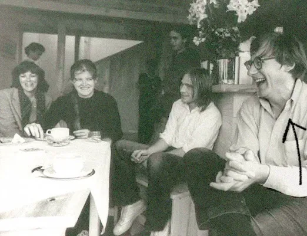
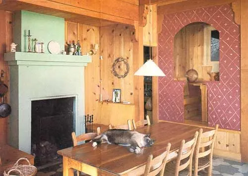

# The Alexandrian Solution

<figure>

<figcaption>Christopher Alexander, the life of the party</figcaption>
</figure>

I feel pretty silly for not re-reading what Christopher Alexander had to say on the matter, back when I articulated the question that started this whole essay. The question, as I then stated it, was, **“why do the same 15 properties of structure that characterize beautiful buildings also appear in healthy software systems?”** In this final chapter, I want to analyze his solution to this puzzle.

The question I posed is a special case of a more general one: “what is the relationship between fact and value?” Or in other words, “what is the relationship between what works and what’s good?” This question is an ancient one, but it has only recently become urgent. The modern era has landed us neck-deep in planet-destroying utilitarianism and impractical, cloying style, and we need to find a way out before we alienate ourselves into oblivion.

As I dug into the chapter of _The Nature of Order_ where Alexander presents his solution to this problem, I remembered why it didn’t click for me five years ago, when I first read it. It struck me at first as too vague, too woolly and “spiritual” to be plausible or falsifiable, so I dismissed it and forgot about it. But now, after thinking through many examples in several different domains, Alexander’s solution seems far less mysterious to me, and I find myself agreeing with him, pretty much the whole way through.

I’m mostly going to just roll the tape and let him talk, though I will occasionally pause to interject my own commentary. Here is how he introduces the topic, on page 404 of _The Phenomenon of Life_.

> No building (and no part of any building) has real life unless it is deeply and robustly functional. What I mean by this, is that the beauty and force of any building arises always, _and in its entirety,_ from the deep functional nature of the [centers](alexander.html#centers) that have been created.
> 
> In nature there is essentially nothing that can be identified as a pure ornament without function. Conversely, in nature there is essentially no system that can be identified as functional which is not also beautiful in an ornamental sense. In nature there simply is no division between ornament and function. \[. . .\]
> 
> I shall try to show that the functional behavior of buildings, the human life present in them, like its geometry, can _all_ also be understood in terms of wholeness. That means that emotion, movement, light, comfort, climate, balance of functions, the ability of a room to accommodate the behavior in the room, the engineering structure, the manufacturing — _all these practical matters can be understood in terms of [centers](alexander.html#centers)_. \[. . .\] All of it can and must be understood as something geometric happening in space.
> 
> During the early and middle 20th century, the idea of function was for the most part understood in a mechanistic spirit. In trying to work out what a building ought to do, how to analyze its way of working, one had the approach that the building’s functions were to be described by a kind of shopping list of “goals.” These goals were defined by the architect or engineer, then achieved.

There’s a clear parallel to agile software development here: Alexander’s “goals” correspond to our features, user stories, epics, and perhaps KPIs (key performance indicators).

> However, there were unsolved puzzles inherent in this idea of needs or goals. Those of us who made lists of functions were aware that these lists were inherently arbitrary (dependent on the architect or client who made them, their forgetfulness, lack of insight, etc.) Where was the _real_ list of needs?

User stories are, of course, only a guess — an approximation of what the user _might_ need, _might_ do, _might_ experience. A software project can deliver everything that was planned, on time and under budget, and still fail because the user stories and UI designs didn’t reflect the real set of needs. There seems to be no way around this. If you try to, say, analyze the requirements more deeply before writing user stories, you get into an infinite regress. How do you know the requirements document is correct?

> I remember making a long list of some 390 requirements which were to describe the ways in which \[Bay Area Rapid Transit\] stations could malfunction. But still, there was an intuitive sense that such a list might be wrong, might be missing items, might be profound or shallow. \[. . .\] **Goals were always arbitrary in some essential way, which could not be mended.**
> 
> \[emphasis added\]

Alexander singles out this focus on goals as a cause of the schism between beauty and function in architecture:

> There were further difficulties. The list of needs or goals, no matter how carefully stated, could only with difficulty be connected to the physical form of a building. \[. . .\] When it came to the physical beauty, ornament, gracefulness of appearance, these matters, obviously important, were in a different category.

To continue the software analogy: a list of user needs, on its own, doesn’t tell you how to design your software internally, and it doesn’t even tell you what the UI should look like. Under this paradigm, the form of the thing (both internal and external), and therefore any aesthetic or emotional appeal that it has, has only a tenuous relationship to its function. If form is considered at all, it must be _after_ the functional requirements of the software have already been determined. The form may then succeed or fail on its own merits, but that has nothing, supposedly, to do with its function. In this view, form for form’s sake is mere ornament — something you tack on after the fact, to “make it pretty.”

Yet this is unsatisfying, and in fact unworkable, because _the form creates the function of the program_. The program cannot function, and in fact cannot exist at all, until there is form. So if we try to separate function and form into distinct “phases” of design, we end up slapping together haphazard forms in the “function” phase, and then trying to patch them up in the “form” phase. The result is a system that neither works well nor feels good.

And we _still_ have the problem that the goals we set upfront weren’t complete or correct to begin with. Sigh.

As unsatisfactory as this is, it’s hard to see how we could do better. Under the current paradigm, it seems impossible to create both beauty _and_ function at a single stroke. I say _seems_ because the problem lies not in our abilities, but in our **[views](https://bensguide.substack.com/i/143550464/views)**: our views about the nature of reality, about what is subjective or objective, about the creative process, and about what it means for a building or software system to “work.”

> During the 20th century, the possibility of finding ways of designing or thinking about beauty and function in one breath seemed remote and unattainable. It was not possible, intellectually, because we did not have the right intellectual tools. It was not possible, artistically, because we could not think our way into a unitary frame of mind where the two could be fused, unified, in works of beauty which worked profoundly well. That was the state of architecture, almost without change, throughout the 20th century.

By now you can probably see what Alexander is about to do: he wants to unify beauty and function by finding a way to get rid of the list of “goals,” or at least to treat it with a healthy irreverence. Now let’s see how he does it:

> \[W\]ithin the view of order which I have put forward in this book it is possible, in principle, to unify these two broken halves. It is possible to think of architecture in a single way where beauty and function — both contributing to life — can be understood as a single, unbroken whole.
> 
> Function, like wholeness itself, is all based on centers. \[. . .\] As something lives, acts in the world, interacts with the world, different centers appear and disappear. Some are moving, some are temporary. The flux of these moving, transitory centers, and their appearing and disappearing, is the process we call life.
> 
> The process we call “function” is the process by which the static system is — or is not — in harmony with this moving system of centers that we call life. \[. . .\] As cars cross a bridge, they form centers. Each car in itself is a center; the stream of cars forms centers; a traffic blockage is a center. The road system, which has its own geometric centers, is either harmonious, or not harmonious, with the system of cars that are parked, moving, standing, and so on.
> 
> When they are harmonious and co-adapted, we call the system functional.

In other words, there is only one kind of harmonious order, which is characterized by the fifteen properties. When we look at this kind of order “from the outside,” as an observer, we see wholeness, beauty, and good function. When we experience the same kind of order “from the inside,” by actually _living in_ a system with the 15 properties — by actually _being_ one of the dynamic centers that creates the life of the system — then we _feel_ whole, at peace with ourselves, free, alive.

The highest purpose of a building, or a software program, is to strengthen this feeling of life in the people around it. And the way that the building or program creates life is very simple: it does it just though its form, through its geometry. Only its geometry, and nothing else.

This is perhaps easiest to see in software systems. The code of a running software application can be viewed as consisting of nothing but pure, abstract structure, like virtual [Tinkertoys](https://en.wikipedia.org/wiki/Tinkertoy). The [Church-Turing thesis](https://en.wikipedia.org/wiki/Church%E2%80%93Turing_thesis) proves the validity of this view: you can compute anything that can be computed with nothing but an elaborate tree of [lambdas](https://en.wikipedia.org/wiki/Lambda_calculus). So it is _only_ structure, and the order of the structure — the way it is put together, the way the different parts relate — that determines the [behavior](https://bensguide.substack.com/p/behavior), and thus the life, of the whole system.

In the same way, the life of a building comes just from its structure. The placement of the building on the site, its relationship to its neighbors, the proportions of the rooms, their arrangement, the placement of the windows and doors and pathways, the way sunlight falls in the rooms, the furniture, the trim, the way the light interacts with materials and human eyes — it is all structure. As we interact with this structure, we label some of our experiences “functional” and others “aesthetic.” But those are just labels. The fundamental thing is the geometry of the structure, and the interactions it creates. In other words, the fundamental thing is the life of the building.

<figure>

<figcaption>
A “farmhouse kitchen” designed by Christopher Alexander
</figcaption>
</figure>

To see the inadequacy of the “functional” and “aesthetic” labels, consider the life of a living room and the furniture and people in it:

*   A living room chair may be comfortable, with cushions and upholstery that are pleasant to sit on. Is this function or aesthetics?
    
*   The seating in a living room might be arranged around a hearth — a **strong center** — and might form a protective **boundary** that separates the seating area from the circulation paths at the edge the room. This arrangement is functional (conducive to conversation) but it is also beautiful _as pure abstract structure_: it makes the room feel cohesive, balanced, and harmonious. So is it functional, or aesthetic?
    
*   The hearth itself can be a beautiful center, but it is also practical: in cold climates it provides needed heat to the house. It also provides a focal point for the room: something for people to gather around, and to look at as they talk. But does that satisfy a functional need? Or an aesthetic one?
    
*   All of these properties of the room encourage people to pause there, to sit down, to relax and talk and generally be convivial. Is this function or aesthetics?
    

These questions don’t have clear answers, but fortunately, under Alexander’s paradigm, they don’t need to be asked. “Function” and “aesthetics” are concepts we’ve imposed on a universe that simply doesn’t care to distinguish between them. Since we made them up, we are free to get rid of them.

To be sure, there are some aspects of life that seem almost purely aesthetic, or almost purely functional. The distinction exists in our modern culture for a reason. But in a paradigm that does away with the distinction, we can still recognize these different aspects of life while also seeing that they are _both_ life, and that they both arise from the same structural properties of centers.

When you view the world from this perspective, everything snaps into focus. Beauty and function are not separate. They are simply two ways of describing a spectrum of experience. That experience is determined by the structure of the system, because _everything_ is determined by the structure of the system.

> The functional behavior of each living room is almost geometrical in nature. What makes the room work is the geometrical intensity, vibrancy, of its living centers, their degree of life. The fifteen properties, the field of centers, and the wholeness not only control the way that beautiful buildings look. _They thoroughly and completely determine the way that buildings work_.
> 
> Altogether I believe the functional life of buildings is created by the same field effect among centers which creates the field of centers in an ornament. Each functional “problem” is solved by the cooperation or integration of centers which arise within the building dynamically, while it is working. The field of centers supports not only everything we commonly call ornament in a building but also everything we commonly call function. \[. . .\] What we call ornament and what we call function are simply two versions of one more general phenomenon.
> 
> —_The Phenomenon of Life_, p. 415

Equipped with this view, the designer, instead of having to grapple with two questions — “how do we make it work” and “how do we make it beautiful” — only needs to consider one: **“what should my next change to the form be, to create the greatest feeling of life in the whole?”** This is a difficult question to answer, but, as I will attempt to show in my [book](https://benchristel.github.io/process-to-processes/), not as difficult as it seems. And it is _far_ more workable, practically, than the alternative under which we are currently suffering.

So, to answer my original question:

> Why do the same 15 properties of structure that characterize beautiful buildings also appear in healthy software systems?

I think Alexander would say that the 15 properties describe a certain kind of structure: orderly, harmonious, whole — whatever you want to call it. A kind of structure that _makes sense_. Sometimes we call this sense-making “beauty” and sometime we call it “function” and sometimes we call it “health” or “wholeness” or “life.” It is all the same thing, the same kind of order.

And to answer Alexander’s rhetorical question,

> Where was the _real_ list of needs?

I would say that there is only one real need, from which all the other specific needs derive: the life of the whole.

_This_ is the need that I constantly return to when creating software. Whenever I am thinking about what to do and how to do it, I always evaluate the result (or my guess at what the result will be) by the life that it creates. By which I mean: is the resulting interaction more pleasant than the status quo? Or, more profoundly: does it make me feel more alive, more of a person, more connected to the work, more truly at ease being myself?

> What is involved in this approach is that we pay attention not only to the functions themselves, but also (and rather) to the overall life of the system as a whole. The approach treats the space as a whole, and tries to make it more harmonious, more alive, more unified _as a_ _whole_.
> 
> —_The Phenomenon of Life_, p. 419

As strange as it sounds, designing for life works. Here is Alexander’s account of how he designed housing in Peru in 1969, beginning with a home-stay with a Peruvian family:

> Before going to Lima, we read various anthropologists’ reports about Peruvian society. It all seemed very exotic, but none of it seemed even remotely useful when we were living in our Peruvian families. For instance, ethnographic reports claimed that Peruvians kept the windows closed at night, even in hot weather, because they didn’t want ghosts to come through the windows with the night air. I never heard anyone say anything like this while I was living in the district of Victoria in Lima.
> 
> I found that I could imagine the Peruvians’ feelings best just by being one of them. For instance it was a dangerous place, and it wasn’t safe to leave windows open at night. That was really all the explanation one needed for why the windows had to be closed, even when it was sweltering hot. I found that if I looked at life from the point of view of being one of them, my own feelings, and my own knowledge of what had to be, was more reliable than anything else as an indicator of what was needed for a Peruvian family.
> 
> The _comedor_ (dining room) in the middle of the house, where everyone came by, watched TV, or sat and talked on the way in or out, was a wonderful place. Being a member of that family, I knew that I needed and wanted such a room — and I could feel exactly where it needed to be in the house (in the middle of everything). \[. . .\] I, myself (as Chris Alexander) didn’t have a house like that, and I don’t want a house like that — because for me, in Berkeley, with my family, it would not have made sense — it would not have been part of things, or part of the way my life works. But as a member of that Peruvian family, in the Peruvian culture, in the context of that family which I was a part of, it _did_ make sense. It was natural, necessary, and I could feel its necessity, as part of _me_.
> 
> —_The Process of Creating Life_, pp. 350–51

By Alexander’s account, the process succeeded:

> \[P\]eople in Peru said that our pattern language and our houses we designed from the pattern language were a more accurate reflection of Peruvian reality than even the Peruvian architects had managed.
> 
> People wondered how we did it. But it was really very simple \[. . . .\] We identified the centers by getting so deeply into the situation that we could feel, in our own bodies, just which ones needed to be there.
> 
> The essential technique in the observation of centers, in any social situation, and in any culture, is to allow the feelings to generate themselves, inside _you_. You have to say, “What would I do if I were one of the people living here, what would it be like for me?” thus inserting yourself into the situation, and then using your own common sense and feelings as a measuring instrument.
> 
> Of course you must always check with people, explicitly. You cannot assume you are right. You have to check. On the other hand, checking doesn’t mean just do what people say; their own sense of what is involved can also be in error. One must always go to the root, asking what is likely to create the most life, and maintaining a cautious skepticism, even while pursuing these difficult and soul-searching questions.
> 
> —_The Process of Creating Life_, p. 352

The process Alexander is describing here — and this is in _1969_, remember — foreshadows Extreme Programming, which recommends having an **onsite customer** for the software you’re building. The idea behind the onsite customer is that if programmers live side-by-side with one of their users, day in and day out, seeing how they work, and experiencing their joys and frustrations, they will develop empathy for those users. Empathy makes it much more likely that the team will build a great product. This technique of “feeling into” another person’s experience, by almost literally standing in their shoes, is exactly the same as what Alexander did in Lima.

Christopher Alexander’s philosophy may seem pretty “out there” at first glance, but putting it into practice feels rather ordinary and commonsense. In a way, what I’ve written above isn’t all that far-fetched, compared to the way we routinely do things in software development today. Ideas like service design, incremental development, refactoring, user interviews, recognition of the [aesthetic-usability effect](https://lawsofux.com/aesthetic-usability-effect/) — these _are_ the state of the art in at least some software companies. I sometimes feel that we are close to achieving Alexander’s vision, and that the philosophy I’m describing is a short step away from how (good) modern software development currently works.

But we are _not_ close. Though some of us may be heading in the right direction, there is a deep chasm between how we _feel_ about our work today, and how we need to feel, in order to generate the kind of world that Alexander envisioned. I said we are one step away, but in reality that step would be a leap: a quantum leap, into a new paradigm, and an entirely new way of viewing our relationship with the world. We aren’t prepared to make that leap yet.

I remain hopeful, though, that someday soon, we will be.

<nav class="centered-text">{{prev}} | {{up}}</nav>